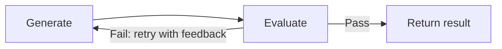

import {GlobalTabs, GlobalTab} from "/snippets/components/global-tabs.jsx";
import { GitHubLink } from '/snippets/blocks/github-link.mdx';
import SetupVercel from '/snippets/tour/ai/setup-vercel.mdx';
import SetupOpenAI from '/snippets/tour/ai/setup-openai.mdx';
import SetupGoogleADK from '/snippets/tour/ai/setup-google-adk.mdx';
import SetupRestateTS from '/snippets/common/setup-restate-ts.mdx';
import SetupRestatePy from '/snippets/common/setup-restate-py.mdx';

Have an agent generate output, then evaluate it with a second LLM call and loop until the quality meets your criteria. Restate persists each iteration, so if the process crashes, it resumes from the last completed evaluation without re-running earlier iterations.



## Example: code generation with quality check

Select your SDK:

<GlobalTabs>
    <GlobalTab title="Vercel AI" icon={"/img/languages/typescript.svg"}/>
    <GlobalTab title="OpenAI Agents" icon={"/img/languages/python.svg"}/>
    <GlobalTab title="Google ADK" icon={"/img/languages/python.svg"}/>
    <GlobalTab title="Restate TS" icon={"/img/languages/typescript.svg"}/>
    <GlobalTab title="Restate Py" icon={"/img/languages/python.svg"}/>
</GlobalTabs>

A generator agent writes code, then an evaluator agent checks it. If the evaluation fails, the generator retries with the feedback. Each iteration is a durable step.

<GlobalTabs className={"hidden-tabs"}>
<GlobalTab title="Vercel AI">

```typescript workflow-evaluator-optimizer.ts {"CODE_LOAD::https://raw.githubusercontent.com/restatedev/ai-examples/refs/heads/ai-structure/vercel-ai/tour-of-agents/src/workflow-evaluator-optimizer.ts#here"}
const generate = async (ctx: restate.Context, {task}: { task: string }) => {
  const model = wrapLanguageModel({
    model: openai("gpt-4o"),
    middleware: durableCalls(ctx, { maxRetryAttempts: 3 }),
  });

  let feedback = "";
  const maxIterations = 3;

  for (let i = 0; i < maxIterations; i++) {
    // Step 1: Generate code
    const { text: code } = await generateText({
      model,
      system: "You are a code generator. Write clean, correct code.",
      prompt: feedback
        ? `Task: ${task}\n\nPrevious attempt was rejected:\n${feedback}\n\nPlease fix the issues.`
        : `Task: ${task}`,
    });

    // Step 2: Evaluate the code
    const { text: evaluation } = await generateText({
      model,
      system: `You are a code reviewer. Evaluate the code for correctness,
            readability, and edge cases. Respond with PASS if acceptable,
            or FAIL: <feedback> with specific issues to fix.`,
      prompt: `Task: ${task}\n\nCode:\n${code}`,
    });

    if (evaluation.startsWith("PASS")) {
      return { code, iterations: i + 1 };
    }

    feedback = evaluation;
  }

  return { code: "Max iterations reached", iterations: maxIterations };
};

const agent = restate.service({
  name: "CodeGenerator",
  handlers: {
    generate: restate.createServiceHandler(
      { input: schema(CodeGenRequestSchema) },
      generate,
    ),
  },
});
```
<GitHubLink url="https://github.com/restatedev/ai-examples/blob/ai-structure/vercel-ai/tour-of-agents/src/workflow-evaluator-optimizer.ts" />

<Accordion title="Run this example" icon="laptop">
<SetupVercel />
```bash
npx tsx ./src/workflow-evaluator-optimizer.ts
```

Register the agents with Restate:
```bash
restate deployments register http://localhost:9080 --force --yes # dev only: overrides previous registrations
```

Sends a request to the agent:
```shell
curl localhost:8080/CodeGenerator/generate \
--json '{
    "task": "Write a TypeScript function that implements a retry mechanism with exponential backoff"
}'
```
</Accordion>

</GlobalTab>
<GlobalTab title="OpenAI Agents">

```python workflow_evaluator_optimizer.py {"CODE_LOAD::https://raw.githubusercontent.com/restatedev/ai-examples/refs/heads/ai-structure/openai-agents/tour-of-agents/app/workflow_evaluator_optimizer.py#here"}
generator = Agent(
    name="CodeGenerator",
    instructions="You are a code generator. Write clean, correct code.",
)

evaluator = Agent(
    name="CodeEvaluator",
    instructions="""You are a code reviewer. Evaluate the code for correctness,
    readability, and edge cases. Respond with PASS if acceptable,
    or FAIL: <feedback> with specific issues to fix.""",
)

code_service = restate.Service("CodeGenerator")


@code_service.handler()
async def generate(ctx: restate.Context, req: CodeRequest) -> dict:
    feedback = ""
    max_iterations = 3

    for i in range(max_iterations):
        # Step 1: Generate code
        prompt = (
            f"Task: {req.task}\n\nPrevious attempt was rejected:\n{feedback}\n\nPlease fix the issues."
            if feedback
            else f"Task: {req.task}"
        )
        gen_result = await DurableRunner.run(generator, prompt)
        code = gen_result.final_output

        # Step 2: Evaluate the code
        eval_result = await DurableRunner.run(
            evaluator, f"Task: {req.task}\n\nCode:\n{code}"
        )
        evaluation = eval_result.final_output

        if evaluation.startswith("PASS"):
            return {"code": code, "iterations": i + 1}

        feedback = evaluation

    return {"code": "Max iterations reached", "iterations": max_iterations}
```
<GitHubLink url="https://github.com/restatedev/ai-examples/blob/ai-structure/openai-agents/tour-of-agents/app/workflow_evaluator_optimizer.py" />

<Accordion title="Run this example" icon="laptop">
<SetupOpenAI />
```bash
uv run app/workflow_evaluator_optimizer.py
```

Register the agents with Restate:
```bash
restate deployments register http://localhost:9080 --force --yes # dev only: overrides previous registrations
```

Send a request:
```bash
curl localhost:8080/CodeGenerator/generate \
  --json '{"task": "Write a function that checks if a string is a palindrome"}'
```
</Accordion>

</GlobalTab>
<GlobalTab title="Google ADK">

```python workflow_evaluator_optimizer.py {"CODE_LOAD::https://raw.githubusercontent.com/restatedev/ai-examples/refs/heads/ai-structure/google-adk/tour-of-agents/app/workflow_evaluator_optimizer.py#here"}
# AGENTS
generator = Agent(
    model="gemini-2.5-flash",
    name="code_generator",
    instruction="You are a code generator. Write clean, correct code.",
)
gen_app = App(name=APP_NAME, root_agent=generator, plugins=[RestatePlugin()])
gen_runner = Runner(app=gen_app, session_service=RestateSessionService())

evaluator = Agent(
    model="gemini-2.5-flash",
    name="code_evaluator",
    instruction="""You are a code reviewer. Evaluate the code for correctness,
    readability, and edge cases. Respond with PASS if acceptable,
    or FAIL: <feedback> with specific issues to fix.""",
)
eval_app = App(name=APP_NAME, root_agent=evaluator, plugins=[RestatePlugin()])
eval_runner = Runner(app=eval_app, session_service=RestateSessionService())

# AGENT SERVICE
code_service = restate.VirtualObject("CodeGenerator")


@code_service.handler()
async def generate(ctx: restate.ObjectContext, req: CodeRequest) -> dict:
    feedback = ""
    max_iterations = 3

    for i in range(max_iterations):
        # Step 1: Generate code
        prompt = (
            f"Task: {req.task}\n\nPrevious attempt was rejected:\n{feedback}\n\nPlease fix the issues."
            if feedback
            else f"Task: {req.task}"
        )
        events = gen_runner.run_async(
            user_id=ctx.key(),
            session_id=str(ctx.uuid()),
            new_message=Content(role="user", parts=[Part.from_text(text=prompt)]),
        )
        code = await parse_agent_response(events)

        # Step 2: Evaluate the code
        events = eval_runner.run_async(
            user_id=ctx.key(),
            session_id=str(ctx.uuid()),
            new_message=Content(role="user", parts=[Part.from_text(text=f"Task: {req.task}\n\nCode:\n{code}")]),
        )
        evaluation = await parse_agent_response(events)
        if evaluation.startswith("PASS"):
            return {"code": code, "iterations": i + 1}
        feedback = evaluation

    return {"code": "Max iterations reached", "iterations": max_iterations}
```
<GitHubLink url="https://github.com/restatedev/ai-examples/blob/ai-structure/google-adk/tour-of-agents/app/workflow_evaluator_optimizer.py" />

<Accordion title="Run this example" icon="laptop">
<SetupGoogleADK />
```bash
uv run app/workflow_evaluator_optimizer.py
```

Register the agents with Restate:
```bash
restate deployments register http://localhost:9080 --force --yes # dev only: overrides previous registrations
```

Send a request:
```bash
curl localhost:8080/CodeGenerator/user123/generate \
  --json '{"task": "Write a function that checks if a string is a palindrome"}'
```
</Accordion>

</GlobalTab>
<GlobalTab title="Restate TS">

```typescript workflow-evaluator-optimizer.ts {"CODE_LOAD::https://raw.githubusercontent.com/restatedev/ai-examples/refs/heads/ai-structure/typescript-restate-only/tour-of-agents/src/workflow-evaluator-optimizer.ts#here"}
const generate = async (ctx: restate.Context, {task}: { task: string }) => {
    let feedback = "";
    const maxIterations = 3;

    for (let i = 0; i < maxIterations; i++) {
      // Step 1: Generate code
      const code = await ctx.run(
        `Generate code (attempt ${i + 1})`,
        async () =>
          llmCall(
            feedback
              ? `You are a code generator. Write clean, correct code.\n\nTask: ${task}\n\nPrevious attempt was rejected:\n${feedback}\n\nPlease fix the issues.`
              : `You are a code generator. Write clean, correct code.\n\nTask: ${task}`,
          ),
        { maxRetryAttempts: 3 },
      );

      // Step 2: Evaluate the code
      const evaluation = await ctx.run(
        `Evaluate code (attempt ${i + 1})`,
        async () =>
          llmCall(
            `You are a code reviewer. Evaluate the code for correctness,
            readability, and edge cases. Respond with PASS if acceptable,
            or FAIL: <feedback> with specific issues to fix.\n\nTask: ${task}\n\nCode:\n${code.text}`,
          ),
        { maxRetryAttempts: 3 },
      );

      if (evaluation.text.startsWith("PASS")) {
        return { code: code.text, iterations: i + 1 };
      }

      feedback = evaluation.text;
    }

    return { code: "Max iterations reached", iterations: maxIterations };
};

const agent = restate.service({
  name: "CodeGenerator",
  handlers: {
    generate: restate.createServiceHandler(
        { input: schema(CodeGenRequestSchema) },
        generate,
    ),
  },
});
```
<GitHubLink url="https://github.com/restatedev/ai-examples/blob/ai-structure/typescript-restate-only/tour-of-agents/src/workflow-evaluator-optimizer.ts" />

<Accordion title="Run this example" icon="laptop">
<SetupRestateTS />

```bash
npx tsx ./src/workflow-evaluator-optimizer.ts
```

Register the services with Restate:
```bash
restate deployments register http://localhost:9080 --force --yes # dev only: overrides previous registrations
```

Send a request:
```bash
curl localhost:8080/CodeGenerator/generate \
  --json '{"task": "Write a function that checks if a string is a palindrome"}'
```
</Accordion>

</GlobalTab>
<GlobalTab title="Restate Py">

```python workflow_evaluator_optimizer.py {"CODE_LOAD::https://raw.githubusercontent.com/restatedev/ai-examples/refs/heads/ai-structure/python-restate-only/tour-of-agents/app/workflow_evaluator_optimizer.py#here"}
code_service = restate.Service("CodeGenerator")


@code_service.handler()
async def generate(ctx: restate.Context, req: CodeRequest) -> dict:
    feedback = ""
    max_iterations = 3

    for i in range(max_iterations):
        # Step 1: Generate code
        prompt = (
            f"Task: {req.task}\n\nPrevious attempt was rejected:\n{feedback}\n\nPlease fix the issues."
            if feedback
            else f"Task: {req.task}"
        )
        code = await ctx.run_typed(
            f"Generate code (attempt {i + 1})",
            llm_call,
            RunOptions(max_attempts=3),
            messages=f"You are a code generator. Write clean, correct code. {prompt}",
        )

        # Step 2: Evaluate the code
        evaluation = await ctx.run_typed(
            f"Evaluate code (attempt {i + 1})",
            llm_call,
            RunOptions(max_attempts=3),
            messages=f"""You are a code reviewer. Evaluate the code for correctness,
            readability, and edge cases. Respond with PASS if acceptable,
            or FAIL: <feedback> with specific issues to fix.
            Task: {req.task}\n\nCode:\n{code.content}""",
        )

        if evaluation.content and evaluation.content.startswith("PASS"):
            return {"code": code.content, "iterations": i + 1}

        feedback = evaluation.content or ""

    return {"code": "Max iterations reached", "iterations": max_iterations}
```
<GitHubLink url="https://github.com/restatedev/ai-examples/blob/ai-structure/python-restate-only/tour-of-agents/app/workflow_evaluator_optimizer.py" />

<Accordion title="Run this example" icon="laptop">
<SetupRestatePy />
```bash
uv run app/workflow_evaluator_optimizer.py
```

Register the services with Restate:
```bash
restate deployments register http://localhost:9080 --force --yes # dev only: overrides previous registrations
```

Send a request:
```bash
curl localhost:8080/CodeGenerator/generate \
  --json '{"task": "Write a function that checks if a string is a palindrome"}'
```
</Accordion>

</GlobalTab>
</GlobalTabs>

Each generate and evaluate call is persisted in the journal. If the process crashes after a successful generation but before evaluation, the generated code is replayed from the journal without calling the LLM again.