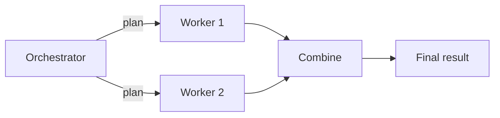

import {GlobalTabs, GlobalTab} from "/snippets/components/global-tabs.jsx";
import { GitHubLink } from '/snippets/blocks/github-link.mdx';
import SetupVercel from '/snippets/tour/ai/setup-vercel.mdx';
import SetupOpenAI from '/snippets/tour/ai/setup-openai.mdx';
import SetupGoogleADK from '/snippets/tour/ai/setup-google-adk.mdx';
import SetupRestateTS from '/snippets/common/setup-restate-ts.mdx';
import SetupRestatePy from '/snippets/common/setup-restate-py.mdx';

An orchestrator agent dynamically decides what tasks to dispatch, and worker agents execute them. The orchestrator can plan, delegate, and combine results in any order. Restate ensures the orchestrator's plan and each worker's result are durably persisted.



## Example: research report generation

Select your SDK:

<GlobalTabs>
    <GlobalTab title="Vercel AI" icon={"/img/languages/typescript.svg"}/>
    <GlobalTab title="OpenAI Agents" icon={"/img/languages/python.svg"}/>
    <GlobalTab title="Google ADK" icon={"/img/languages/python.svg"}/>
    <GlobalTab title="Restate TS" icon={"/img/languages/typescript.svg"}/>
    <GlobalTab title="Restate Py" icon={"/img/languages/python.svg"}/>
</GlobalTabs>

An orchestrator agent breaks a research topic into sub-tasks, dispatches them to worker agents, and combines the results into a report.

<GlobalTabs className={"hidden-tabs"}>
<GlobalTab title="Vercel AI">

```typescript workflow-orchestrator.ts {"CODE_LOAD::https://raw.githubusercontent.com/restatedev/ai-examples/refs/heads/ai-structure/vercel-ai/tour-of-agents/src/workflow-orchestrator.ts#here"}
export const researchWorker = restate.service({
  name: "ResearchWorker",
  handlers: {
    research: async (ctx: restate.Context, {question}: { question: string }) => {
      const model = wrapLanguageModel({
        model: openai("gpt-4o"),
        middleware: durableCalls(ctx, { maxRetryAttempts: 3 }),
      });
      const { text: answer } = await generateText({
        model,
        system:
          "You are a research assistant. Provide a concise, factual answer.",
        prompt: question,
      });
      return { question, answer };
    },
  },
});

const orchestrator = restate.service({
  name: "ResearchReport",
  handlers: {
    generate: restate.createServiceHandler(
      { input: schema(ResearchRequestSchema) },
      async (ctx: restate.Context, {topic}: { topic: string }) => {
        const model = wrapLanguageModel({
          model: openai("gpt-4o"),
          middleware: durableCalls(ctx, { maxRetryAttempts: 3 }),
        });

        // Step 1: Orchestrator creates a research plan
        const { output: tasks } = await generateText({
          model,
          system: `You are a research planner. Break the topic into 2-4 research
          sub-tasks. Respond with a JSON array of strings, each a specific
          research question. Example: ["question 1", "question 2"]`,
          prompt: topic,
          output: Output.array({element: z.string()})
        });

        // Step 2: Dispatch workers in parallel
        const workerResults = await RestatePromise.all(
          tasks.map((question) =>
            ctx.serviceClient(researchWorker).research({ question }),
          ),
        );

        // Step 3: Combine results into a report
        const { text: report } = await generateText({
          model,
          system:
            "You are a report writer. Combine the research findings into a cohesive report.",
          prompt: `Topic: ${topic}\n\nResearch findings:\n${JSON.stringify(workerResults)}`,
        });

        return { report, taskCount: tasks.length };
      },
    ),
  },
});
```
<GitHubLink url="https://github.com/restatedev/ai-examples/blob/ai-structure/vercel-ai/tour-of-agents/src/workflow-orchestrator.ts" />

<Accordion title="Run this example" icon="laptop">
<SetupVercel />
```bash
npx tsx ./src/workflow-orchestrator.ts
```

Register the agents with Restate:
```bash
restate deployments register http://localhost:9080 --force --yes # dev only: overrides previous registrations
```

Send a request to the agent:
```shell
curl localhost:8080/ResearchReport/generate \
--json '{
    "topic": "Benefits of durable execution in distributed systems"
}'
```
</Accordion>

</GlobalTab>
<GlobalTab title="OpenAI Agents">

```python workflow_orchestrator.py {"CODE_LOAD::https://raw.githubusercontent.com/restatedev/ai-examples/refs/heads/ai-structure/openai-agents/tour-of-agents/app/workflow_orchestrator.py#here"}
planner = Agent(
    name="ResearchPlanner",
    instructions="""You are a research planner. Break the topic into 2-4 research
    sub-tasks. Respond with a JSON array of strings, each a specific
    research question. Example: ["question 1", "question 2"]""",
)

researcher = Agent(
    name="Researcher",
    instructions="You are a research assistant. Provide a concise, factual answer."
)

writer = Agent(
    name="ReportWriter",
    instructions="You are a report writer. Combine the research findings into a cohesive report.",
)

report_service = restate.Service("ResearchReport")


@report_service.handler()
async def generate(ctx: restate.Context, req: ReportRequest) -> dict:
    # Step 1: Orchestrator creates a research plan
    plan_result = await DurableRunner.run(planner, req.topic)
    tasks = json.loads(plan_result.final_output)

    # Step 2: Dispatch workers in parallel
    worker_promises = []
    for task in tasks:
        promise = ctx.service_call(run_researcher, ResearchTask(question=task))
        worker_promises.append(promise)

    await restate.gather(*worker_promises)
    findings = [await p for p in worker_promises]

    # Step 3: Combine results into a report
    report_result = await DurableRunner.run(
        writer,
        f"Topic: {req.topic}\n\nResearch findings:\n{json.dumps(findings, indent=2)}",
    )

    return {"report": report_result.final_output, "task_count": len(tasks)}


researcher_service = restate.Service("Researcher")


@researcher_service.handler()
async def run_researcher(ctx: restate.Context, task: ResearchTask) -> str:
    result = await DurableRunner.run(researcher, task.question)
    return result.final_output
```
<GitHubLink url="https://github.com/restatedev/ai-examples/blob/ai-structure/openai-agents/tour-of-agents/app/workflow_orchestrator.py" />

<Accordion title="Run this example" icon="laptop">
<SetupOpenAI />
```bash
uv run app/workflow_orchestrator.py
```

Register the agents with Restate:
```bash
restate deployments register http://localhost:9080 --force --yes # dev only: overrides previous registrations
```

Send a request:
```bash
curl localhost:8080/ResearchReport/generate \
  --json '{"topic": "The impact of renewable energy on global economies"}'
```
</Accordion>

</GlobalTab>
<GlobalTab title="Google ADK">

```python workflow_orchestrator.py {"CODE_LOAD::https://raw.githubusercontent.com/restatedev/ai-examples/refs/heads/ai-structure/google-adk/tour-of-agents/app/workflow_orchestrator.py#here"}
report_service = restate.VirtualObject("ResearchReport")


@report_service.handler()
async def generate(ctx: restate.ObjectContext, req: ReportRequest) -> dict:
    session_id = str(ctx.uuid())
    # Step 1: Orchestrator creates a research plan
    plan_events = plan_runner.run_async(
        user_id=ctx.key(),
        session_id=session_id,
        new_message=Content(role="user", parts=[Part.from_text(text=req.topic)]),
    )
    plan_output =  await parse_agent_response(plan_events)
    tasks = TaskList.model_validate_json(plan_output).tasks

    # Step 2: Dispatch workers in parallel
    worker_promises = []
    for task in tasks:
        promise = ctx.service_call(run_researcher, ResearchTask(question=task))
        worker_promises.append(promise)

    await restate.gather(*worker_promises)
    findings = [await p for p in worker_promises]

    # Step 3: Combine results into a report
    results = f"Topic: {req.topic}\n\nResearch findings:\n{json.dumps(findings)}"
    events = writer_runner.run_async(
        user_id=ctx.key(),
        session_id=session_id,
        new_message=Content(role="user", parts=[Part.from_text(text=results)]),
    )
    report = await parse_agent_response(events)

    return {"report": report, "task_count": len(tasks)}


researcher_service = restate.VirtualObject("Researcher")


@researcher_service.handler()
async def run_researcher(ctx: restate.ObjectContext, task: ResearchTask) -> str:
    events = research_runner.run_async(
        user_id=ctx.key(),
        session_id=str(ctx.uuid()),
        new_message=Content(role="user", parts=[Part.from_text(text=task.question)]),
    )
    return await parse_agent_response(events)
```
<GitHubLink url="https://github.com/restatedev/ai-examples/blob/ai-structure/google-adk/tour-of-agents/app/workflow_orchestrator.py" />

<Accordion title="Run this example" icon="laptop">
<SetupGoogleADK />
```bash
uv run app/workflow_orchestrator.py
```

Register the agents with Restate:
```bash
restate deployments register http://localhost:9080 --force --yes # dev only: overrides previous registrations
```

Send a request:
```bash
curl localhost:8080/ResearchReport/user123/generate \
  --json '{
    "sessionId": "session-123",
    "topic": "The impact of renewable energy on global economies"
  }'
```
</Accordion>

</GlobalTab>
<GlobalTab title="Restate TS">

```typescript workflow-orchestrator.ts {"CODE_LOAD::https://raw.githubusercontent.com/restatedev/ai-examples/refs/heads/ai-structure/typescript-restate-only/tour-of-agents/src/workflow-orchestrator.ts#here"}
export const researchWorker = restate.service({
  name: "ResearchWorker",
  handlers: {
    research: async (ctx: restate.Context, req: { question: string }) => {
      const answer = await ctx.run(
        "Research",
        async () =>
          llmCall(
            `You are a research assistant. Provide a concise, factual answer.\n\n${req.question}`,
          ),
        { maxRetryAttempts: 3 },
      );
      return { question: req.question, answer: answer.text };
    },
  },
});

const orchestrator = restate.service({
  name: "ResearchReport",
  handlers: {
    generate: restate.createServiceHandler(
        { input: schema(ResearchRequestSchema) },
        async (ctx: restate.Context, {topic}: { topic: string }) => {
      // Step 1: Orchestrator creates a research plan
      const planJson = await ctx.run(
        "Create research plan",
        async () =>
          llmCall(
            `You are a research planner. Break the topic into 2-4 research
          sub-tasks. Respond with a JSON array of strings, each a specific
          research question. Example: ["question 1", "question 2"]\n\nTopic: ${topic}`,
          ),
        { maxRetryAttempts: 3 },
      );
      const tasks: string[] = JSON.parse(planJson.text);

      // Step 2: Dispatch workers in parallel
      const workerResults = await RestatePromise.all(
        tasks.map((question) =>
          ctx.serviceClient(researchWorker).research({ question }),
        ),
      );

      // Step 3: Combine results into a report
      const report = await ctx.run(
        "Write report",
        async () =>
          llmCall(
            `You are a report writer. Combine the research findings into a cohesive report.\n\n
            Topic: ${topic}\n\nResearch findings:\n${JSON.stringify(workerResults)}`,
          ),
        { maxRetryAttempts: 3 },
      );

      return { report: report.text, taskCount: tasks.length };
        },
    ),
  },
});
```
<GitHubLink url="https://github.com/restatedev/ai-examples/blob/ai-structure/typescript-restate-only/tour-of-agents/src/workflow-orchestrator.ts" />

<Accordion title="Run this example" icon="laptop">
<SetupRestateTS />

```bash
npx tsx ./src/workflow-orchestrator.ts
```

Register the services with Restate:
```bash
restate deployments register http://localhost:9080 --force --yes # dev only: overrides previous registrations
```

Send a request:
```bash
curl localhost:8080/ResearchReport/generate \
  --json '{"topic": "The impact of renewable energy on global economies"}'
```
</Accordion>

</GlobalTab>
<GlobalTab title="Restate Py">

```python workflow_orchestrator.py {"CODE_LOAD::https://raw.githubusercontent.com/restatedev/ai-examples/refs/heads/ai-structure/python-restate-only/tour-of-agents/app/workflow_orchestrator.py#here"}
researcher_service = restate.Service("ResearchWorker")


@researcher_service.handler()
async def research(ctx: restate.Context, req: ResearchTask) -> dict:
    answer = await ctx.run_typed(
        "Research",
        llm_call,
        RunOptions(max_attempts=3),
        messages=f"You are a research assistant. Provide a concise, factual answer. {req.question}",
    )
    return {"question": req.question, "answer": answer.content}


report_service = restate.Service("ResearchReport")


@report_service.handler()
async def generate(ctx: restate.Context, req: ReportRequest) -> dict:
    # Step 1: Orchestrator creates a research plan
    plan_result = await ctx.run_typed(
        "Create research plan",
        llm_call,
        RunOptions(max_attempts=3),
        messages=f"You are a research planner. Break the topic into 2-4 research sub-tasks. {req.topic}",
        response_format=TaskList,
    )
    if not plan_result.content:
        raise restate.TerminalError("No research plan created")
    tasks = TaskList.model_validate_json(plan_result.content).tasks

    # Step 2: Dispatch workers in parallel
    worker_promises = []
    for task in tasks:
        promise = ctx.service_call(research, ResearchTask(question=task))
        worker_promises.append(promise)

    await restate.gather(*worker_promises)
    findings = [await p for p in worker_promises]

    # Step 3: Combine results into a report
    report = await ctx.run_typed(
        "Write report",
        llm_call,
        RunOptions(max_attempts=3),
        messages=f"You are a report writer. Combine the research findings into a cohesive report."
               f"Topic: {req.topic}\n\nResearch findings:\n{json.dumps(findings)}",
    )

    return {"report": report.content, "task_count": len(tasks)}
```
<GitHubLink url="https://github.com/restatedev/ai-examples/blob/ai-structure/python-restate-only/tour-of-agents/app/workflow_orchestrator.py" />

<Accordion title="Run this example" icon="laptop">
<SetupRestatePy />
```bash
uv run app/workflow_orchestrator.py
```

Register the services with Restate:
```bash
restate deployments register http://localhost:9080 --force --yes # dev only: overrides previous registrations
```

Send a request:
```bash
curl localhost:8080/ResearchReport/generate \
  --json '{"topic": "The impact of renewable energy on global economies"}'
```
</Accordion>

</GlobalTab>
</GlobalTabs>

The orchestrator's plan is persisted as a durable step. If the process crashes after two of four workers have completed, recovery replays those two results from the journal and only runs the remaining two workers.