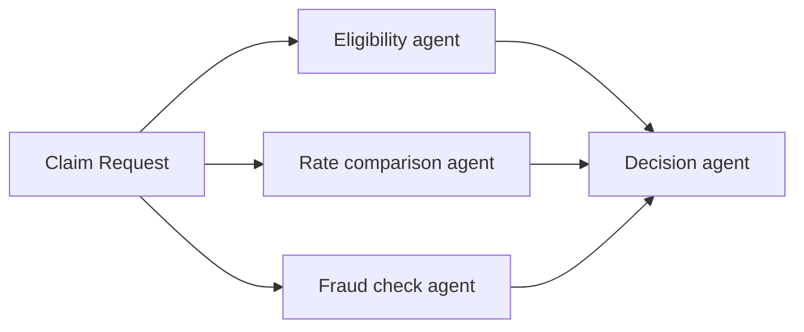

import {GlobalTabs, GlobalTab} from "/snippets/components/global-tabs.jsx";
import { GitHubLink } from '/snippets/blocks/github-link.mdx';
import SetupVercel from '/snippets/tour/ai/setup-vercel.mdx';
import SetupOpenAI from '/snippets/tour/ai/setup-openai.mdx';
import SetupGoogleADK from '/snippets/tour/ai/setup-google-adk.mdx';
import SetupRestateTS from '/snippets/common/setup-restate-ts.mdx';
import SetupRestatePy from '/snippets/common/setup-restate-py.mdx';

Fan out work to multiple agents, then combine the results. Restate runs the agents in parallel with automatic retries and recovery. If one agent fails, only that agent is retried, the successful results are preserved.



## Example: parallel claim analysis

Select your SDK:

<GlobalTabs>
    <GlobalTab title="Vercel AI" icon={"/img/languages/typescript.svg"}/>
    <GlobalTab title="OpenAI Agents" icon={"/img/languages/python.svg"}/>
    <GlobalTab title="Google ADK" icon={"/img/languages/python.svg"}/>
    <GlobalTab title="Restate TS" icon={"/img/languages/typescript.svg"}/>
    <GlobalTab title="Restate Py" icon={"/img/languages/python.svg"}/>
</GlobalTabs>


Three specialist agents analyze a claim concurrently. A decision agent combines their results.

<GlobalTabs className={"hidden-tabs"}>
<GlobalTab title="Vercel AI">

```typescript workflow-parallel.ts {"CODE_LOAD::https://raw.githubusercontent.com/restatedev/ai-examples/refs/heads/main/vercel-ai/tour-of-agents/src/workflow-parallel.ts#here"} 
const run = async (ctx: restate.Context, claim: ClaimInput) => {
  const [eligibility, rateComparison, fraudCheck] = await RestatePromise.all([
    ctx.serviceClient(eligibilityAgent).run(claim),
    ctx.serviceClient(rateComparisonAgent).run(claim),
    ctx.serviceClient(fraudCheckAgent).run(claim),
  ]);

  const model = wrapLanguageModel({
    model: openai("gpt-4o"),
    middleware: durableCalls(ctx, { maxRetryAttempts: 3 }),
  });

  const { text } = await generateText({
    model,
    system: "You are a claim decision engine.",
    prompt: `Decide about claim ${JSON.stringify(claim)}.
        Base your decision on the following analyses:
        Eligibility: ${eligibility}, Cost: ${rateComparison} Fraud: ${fraudCheck}`,
  });
  return text;
};
```
<GitHubLink url="https://github.com/restatedev/ai-examples/tree/ai-structure/vercel-ai/tour-of-agents/src/workflow-parallel.ts" />

<Accordion title="Try out parallel agents" icon="laptop">
<SetupVercel />
```bash
npx tsx ./src/workflow-parallel.ts
```

Register the agents with Restate:
```bash
restate deployments register http://localhost:9080 --force --yes # dev only: overrides previous registrations
```

Start a request for a claim that needs to be analyzed by multiple agents in parallel:
```bash
curl localhost:8080/ParallelAgentClaimApproval/run --json '{
    "date":"2024-10-01",
    "category":"orthopedic",
    "reason":"hospital bill for a broken leg",
    "amount":3000,
    "placeOfService":"General Hospital"
}'
```

In the UI, you can see that the handler called the sub-agents in parallel.
Once all sub-agents return, the main agent makes a decision.

<Frame>

</Frame>
</Accordion>

</GlobalTab>
<GlobalTab title="OpenAI Agents">

```python workflow_parallel.py {"CODE_LOAD::https://raw.githubusercontent.com/restatedev/ai-examples/refs/heads/main/openai-agents/tour-of-agents/app/workflow_parallel.py#here"} 
@agent_service.handler()
async def run(restate_context: restate.Context, claim: InsuranceClaim) -> str:
    # Start multiple agents in parallel with auto retries and recovery
    eligibility = restate_context.service_call(run_eligibility_agent, claim)
    cost = restate_context.service_call(run_rate_comparison_agent, claim)
    fraud = restate_context.service_call(run_fraud_agent, claim)

    # Wait for all responses
    await restate.gather(eligibility, cost, fraud)

    # Run decision agent on outputs
    result = await DurableRunner.run(
        Agent(
            name="ClaimApprovalAgent", instructions="You are a claim decision engine."
        ),
        input=f"Decide about claim: {claim.model_dump_json()}. "
        "Base your decision on the following analyses:"
        f"Eligibility: {await eligibility} Cost {await cost} Fraud: {await fraud}",
    )
    return result.final_output
```
<GitHubLink url="https://github.com/restatedev/ai-examples/blob/main/openai-agents/tour-of-agents/app/workflow_parallel.py" />

<Accordion title="Try out parallel agents" icon="laptop">
<SetupOpenAI />
```bash
uv run app/workflow_parallel.py
```

Register the agents with Restate:
```bash
restate deployments register http://localhost:9080 --force --yes # dev only: overrides previous registrations
```

Start a request for a claim that needs to be analyzed by multiple agents in parallel:
```bash
curl localhost:8080/ParallelAgentClaimApproval/run --json '{
    "date":"2024-10-01",
    "category":"orthopedic",
    "reason":"hospital bill for a broken leg",
    "amount":3000,
    "placeOfService":"General Hospital"
}'
```

In the UI, you can see that the handler called the sub-agents in parallel.
Once all sub-agents return, the main agent makes a decision.

<Frame>

</Frame>
</Accordion>

</GlobalTab>
<GlobalTab title="Google ADK">

```python workflow_parallel.py {"CODE_LOAD::https://raw.githubusercontent.com/restatedev/ai-examples/refs/heads/main/google-adk/tour-of-agents/app/workflow_parallel.py#here"} 
@agent_service.handler()
async def run(ctx: restate.ObjectContext, claim: InsuranceClaim) -> str | None:

    # Start multiple agents in parallel with auto retries and recovery
    eligibility = ctx.service_call(run_eligibility_agent, claim)
    cost = ctx.service_call(run_rate_comparison_agent, claim)
    fraud = ctx.service_call(run_fraud_agent, claim)

    # Wait for all responses
    await restate.gather(eligibility, cost, fraud)

    # Get the results
    eligibility_result = await eligibility
    cost_result = await cost
    fraud_result = await fraud

    # Run decision agent on outputs
    prompt = f"""Decide about claim: {claim.model_dump_json()}. Assessments:
    Eligibility: {eligibility_result} Cost: {cost_result} Fraud: {fraud_result}"""

    events = runner.run_async(
        user_id=ctx.key(),
        session_id=claim.session_id,
        new_message=Content(role="user", parts=[Part.from_text(text=prompt)]),
    )
    return await parse_agent_response(events)
```
<GitHubLink url="https://github.com/restatedev/ai-examples/blob/main/google-adk/tour-of-agents/app/workflow_parallel.py" />

<Accordion title="Try out parallel agents" icon="laptop">
<SetupGoogleADK />
```bash
uv run app/workflow_parallel.py
```

Register the agents with Restate:
```bash
restate deployments register http://localhost:9080 --force --yes # dev only: overrides previous registrations
```

Start a request for a claim that needs to be analyzed by multiple agents in parallel:
```bash
curl localhost:8080/ParallelAgentClaimApproval/user123/run --json '{
    "amount": 3000,
    "category": "orthopedic",
    "date": "2024-10-01",
    "placeOfService": "General Hospital",
    "reason": "hospital bill for a broken leg",
    "sessionId": "session-123"
}'
```

In the UI, you can see that the handler called the sub-agents in parallel.
Once all sub-agents return, the main agent makes a decision.

<Frame>

</Frame>
</Accordion>

</GlobalTab>
<GlobalTab title="Restate TS">

```typescript workflow-parallel.ts {"CODE_LOAD::https://raw.githubusercontent.com/restatedev/ai-examples/refs/heads/main/typescript-restate-only/tour-of-agents/src/workflow-parallel.ts#here"} 
async function run(ctx: Context, claim: ClaimInput) {
  // Create parallel tasks - each runs independently
  const claimJson = JSON.stringify(claim);
  const eligibility = ctx.run(
    "Eligibility agent",
    async () => llmCall(
        "Decide whether the following claim is eligible for reimbursement." +
        "Respond with eligible if it's a medical claim, and not eligible otherwise." +
        "\n\nClaim: " + claimJson,
    ),
    { maxRetryAttempts: 3 },
  )
  const fraud = ctx.run(
    "Fraud agent",
      async () => llmCall(
          "Decide whether the claim is fraudulent." +
          "Always respond with low risk, medium risk, or high risk." +
          "\n\nClaim: " + claimJson,
    ),
    { maxRetryAttempts: 3 },
  )
  const cost = ctx.run(
    "Rate comparison agent",
      async () => llmCall(
          "Decide whether the cost of the claim is reasonable given the treatment." +
          "Respond with reasonable or not reasonable." +
          "\n\nClaim: " + claimJson,
    ),
    { maxRetryAttempts: 3 },
  )

  // Wait for all tasks to complete and return the results
  await RestatePromise.all([eligibility, cost, fraud]);

  // Make final decision
  const { text } = await ctx.run(
      "Decision agent",
      async () => llmCall( `Decide about claim ${JSON.stringify(claim)}.
        Base your decision on the following analyses:
        - Eligibility: ${(await eligibility).text}, 
        - Cost: ${(await cost).text},
        - Fraud: ${(await fraud).text}`)
  );
  return text
}
```
<GitHubLink url="https://github.com/restatedev/ai-examples/blob/main/typescript-restate-only/tour-of-agents/src/workflow-parallel.ts" />

<Accordion title="Run this example" icon="laptop">
<SetupRestateTS />

```bash
npx tsx ./src/workflow-parallel.ts
```

Register the services with Restate:
```bash
restate deployments register http://localhost:9080 --force --yes # dev only: overrides previous registrations
```

Send a request:
```bash
curl localhost:8080/ParallelAgentClaimApproval/run --json '{
    "date":"2024-10-01",
    "category":"orthopedic",
    "reason":"hospital bill for a broken leg",
    "amount":3000,
    "placeOfService":"General Hospital"
}'
```
</Accordion>

</GlobalTab>
<GlobalTab title="Restate Py">

```python workflow_parallel.py {"CODE_LOAD::https://raw.githubusercontent.com/restatedev/ai-examples/refs/heads/main/python-restate-only/tour-of-agents/app/workflow_parallel.py#here"} 
parallelization_svc = restate.Service("ParallelAgentClaimApproval")


@parallelization_svc.handler()
async def run(ctx: restate.Context, claim: ClaimData) -> str | None:
    """Analyzes a claim in parallel with specialized agents."""

    # Create parallel tasks - each runs independently
    claim_json = json.dumps(claim.model_dump())
    eligibility = ctx.run_typed(
        "Eligibility agent",
        llm_call,
        RunOptions(max_attempts=3),
        messages="Decide whether the following claim is eligible for reimbursement."
        " Respond with eligible if it's a medical claim, and not eligible otherwise."
        f"\n\nClaim: {claim_json}",
    )
    fraud = ctx.run_typed(
        "Fraud agent",
        llm_call,
        RunOptions(max_attempts=3),
        messages="Decide whether the claim is fraudulent."
        " Always respond with low risk, medium risk, or high risk."
        f"\n\nClaim: {claim_json}",
    )
    rate = ctx.run_typed(
        "Rate comparison agent",
        llm_call,
        RunOptions(max_attempts=3),
        messages="Decide whether the cost of the claim is reasonable given the treatment."
        " Respond with reasonable or not reasonable."
        f"\n\nClaim: {claim_json}",
    )

    # Wait for all tasks to complete
    await restate.gather(eligibility, fraud, rate)

    # Make final decision
    decision = await ctx.run_typed(
        "Decision agent",
        llm_call,
        RunOptions(max_attempts=3),
        messages=f"Decide about claim: {claim.model_dump_json()}. "
        "Base your decision on the following analyses:"
        f"Eligibility: {(await eligibility).content} "
        f"Cost: {(await rate).content} "
        f"Fraud: {(await fraud).content}",
    )
    return decision.content
```
<GitHubLink url="https://github.com/restatedev/ai-examples/blob/main/python-restate-only/tour-of-agents/app/workflow_parallel.py" />

<Accordion title="Run this example" icon="laptop">
<SetupRestatePy />
```bash
uv run app/workflow_parallel.py
```

Register the services with Restate:
```bash
restate deployments register http://localhost:9080 --force --yes # dev only: overrides previous registrations
```

Send a request:
```bash
curl localhost:8080/ParallelAgentClaimApproval/run --json '{
    "date":"2024-10-01",
    "category":"orthopedic",
    "reason":"hospital bill for a broken leg",
    "amount":3000,
    "placeOfService":"General Hospital"
}'
```
</Accordion>

</GlobalTab>
</GlobalTabs>