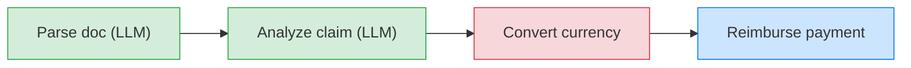

import {GlobalTabs, GlobalTab} from "/snippets/components/global-tabs.jsx";
import { GitHubLink } from '/snippets/blocks/github-link.mdx';
import SetupVercel from '/snippets/tour/ai/setup-vercel.mdx';
import SetupOpenAI from '/snippets/tour/ai/setup-openai.mdx';
import SetupGoogleADK from '/snippets/tour/ai/setup-google-adk.mdx';
import SetupRestateTS from '/snippets/common/setup-restate-ts.mdx';
import SetupRestatePy from '/snippets/common/setup-restate-py.mdx';

Real-world workflows often mix LLM-powered steps (parsing documents, analyzing data) with traditional steps (API calls, database writes, payments). Restate lets you chain these together in a single durable pipeline where each step is persisted. If the process crashes after step 2 of 4, recovery skips the completed steps and resumes from step 3.


Chain agentic and traditional steps in sequence. Restate records the result of each step. On recovery:
- Completed steps are replayed instantly from the journal
- LLM calls are not repeated (saving cost and time)
- Regular steps (API calls, payments) are not duplicated




## Example: insurance claim reimbursement

Select your SDK:
<GlobalTabs>
    <GlobalTab title="Vercel AI" icon={"/img/languages/typescript.svg"}/>
    <GlobalTab title="OpenAI Agents" icon={"/img/languages/python.svg"}/>
    <GlobalTab title="Google ADK" icon={"/img/languages/python.svg"}/>
    <GlobalTab title="Restate TS" icon={"/img/languages/typescript.svg"}/>
    <GlobalTab title="Restate Py" icon={"/img/languages/python.svg"}/>
</GlobalTabs>

This workflow processes an insurance claim through four steps: two agentic steps that use an LLM to understand unstructured data, and two traditional steps that call external APIs.

<GlobalTabs className={"hidden-tabs"}>
<GlobalTab title="Vercel AI">

```typescript workflow-sequential.ts {"CODE_LOAD::https://raw.githubusercontent.com/restatedev/ai-examples/refs/heads/ai-structure/vercel-ai/tour-of-agents/src/workflow-sequential.ts#here"}
const process = async (ctx: Context, {prompt}: {prompt: string}) => {
  const model = wrapLanguageModel({
    model: openai("gpt-4o"),
    middleware: durableCalls(ctx, { maxRetryAttempts: 3 }),
  });

  // Step 1: Parse the claim document (LLM step)
  const { output } = await generateText({
    model,
    system:
      "Extract the claim amount, currency, category, and description.",
    prompt,
    output: Output.object({schema: ClaimData})
  });

  // Step 2: Analyze the claim (LLM step)
  const { output: valid } = await generateText({
    model,
    system:
      "You are a claims analyst. Assess whether this claim is valid and determine the approved amount.",
    prompt: `Claim: ${JSON.stringify(output)}`,
    output: Output.object({schema: z.object({valid: z.boolean()})}),
  });

  if (!valid) {
    return { analysis: "Claim is invalid", amountUsd: 0, confirmation: false };
  }

  // Step 3: Convert currency (regular step)
  const amountUsd = await ctx.run("Convert currency", async () =>
    convertCurrency(output.amount, output.currency, "USD"),
  );

  // Step 4: Process reimbursement (regular step)
  const confirmation = await ctx.run("Process payment", async () =>
    processPayment(ctx.rand.uuidv4(), amountUsd),
  );

  return { analysis: "Claim is valid", amountUsd, confirmation };
};
```
<GitHubLink url="https://github.com/restatedev/ai-examples/blob/ai-structure/vercel-ai/tour-of-agents/src/workflow-sequential.ts" />

<Accordion title="Run this example" icon="laptop">
<SetupVercel />
```bash
npx tsx ./src/workflow-sequential.ts
```

Register the agents with Restate:
```bash
restate deployments register http://localhost:9080 --force --yes # dev only: overrides previous registrations
```

Send a request to the agent:
```shell
curl localhost:8080/ClaimReimbursement/process --json '{
    "prompt": "Process my hospital bill of 2024-10-01 for 3000USD for a broken leg at General Hospital."
}'
```
</Accordion>

</GlobalTab>
<GlobalTab title="OpenAI Agents">

```python workflow_sequential.py {"CODE_LOAD::https://raw.githubusercontent.com/restatedev/ai-examples/refs/heads/ai-structure/openai-agents/tour-of-agents/app/workflow_sequential.py#here"}
claim_service = restate.Service("ClaimReimbursement")


@claim_service.handler()
async def process(ctx: restate.Context, req: ClaimPrompt) -> dict:
    # Step 1: Parse the claim document (LLM step)
    parse_agent = Agent(
        name="DocumentParser",
        instructions="Extract the claim amount, currency, category, and description.",
        output_type=ClaimData
    )
    parsed = await DurableRunner.run(parse_agent, req.message)
    claim = parsed.final_output

    # Step 2: Analyze the claim (LLM step)
    analysis_agent = Agent(
        name="ClaimsAnalyst",
        instructions="Assess whether this claim is valid and determine the approved amount.",
    )
    analysis = await DurableRunner.run(analysis_agent, f"Claim: {parsed.final_output.model_dump_json()}")

    # Step 3: Convert currency (regular step)
    amount_usd = await ctx.run_typed(
        "Convert currency",
        convert_currency,
        amount=claim.amount,
        source=claim.currency,
        target="USD",
    )

    # Step 4: Process reimbursement (regular step)
    confirmation = await ctx.run_typed(
        "Process payment",
        process_payment,
        claim_id=str(ctx.uuid()),
        amount=amount_usd,
    )

    return {
        "analysis": analysis.final_output,
        "amount_usd": amount_usd,
        "confirmation": confirmation,
    }
```
<GitHubLink url="https://github.com/restatedev/ai-examples/blob/ai-structure/openai-agents/tour-of-agents/app/workflow_sequential.py" />

<Accordion title="Run this example" icon="laptop">
<SetupOpenAI />
```bash
uv run app/workflow_sequential.py
```

Register the agents with Restate:
```bash
restate deployments register http://localhost:9080 --force --yes # dev only: overrides previous registrations
```

Send a request:
```bash
curl localhost:8080/ClaimReimbursement/process --json '{
    "message": "Process my hospital bill of 2024-10-01 for 3000USD for a broken leg at General Hospital."
}'
```
</Accordion>

</GlobalTab>
<GlobalTab title="Google ADK">

```python workflow_sequential.py {"CODE_LOAD::https://raw.githubusercontent.com/restatedev/ai-examples/refs/heads/ai-structure/google-adk/tour-of-agents/app/workflow_sequential.py#here"}
parse_agent = Agent(
    model="gemini-2.5-flash",
    name="document_parser",
    instruction="Extract the claim amount, currency, category, and description.",
    output_schema=ClaimData
)
parse_app = App(name="claims", root_agent=parse_agent, plugins=[RestatePlugin()])
parse_runner = Runner(app=parse_app, session_service=RestateSessionService())

analysis_agent = Agent(
    model="gemini-2.5-flash",
    name="claims_analyst",
    instruction="Assess whether this claim is valid and determine the approved amount.",
)
analysis_app = App(name="claims", root_agent=analysis_agent, plugins=[RestatePlugin()])
analysis_runner = Runner(app=analysis_app, session_service=RestateSessionService())

claim_service = restate.VirtualObject("ClaimReimbursement")


@claim_service.handler()
async def process(ctx: restate.ObjectContext, req: ClaimPrompt) -> dict:
    # Step 1: Parse the claim document (LLM step)
    parsing_events = parse_runner.run_async(
        user_id=ctx.key(),
        session_id=req.session_id,
        new_message=Content(role="user", parts=[Part.from_text(text=req.message)]),
    )
    parsed = await parse_agent_response(parsing_events)
    claim = ClaimData.model_validate_json(parsed)

    # Step 2: Analyze the claim (LLM step)
    analysis_events = analysis_runner.run_async(
        user_id=ctx.key(),
        session_id=req.session_id,
        new_message=Content(role="user", parts=[Part.from_text(text=parsed)]),
    )
    analysis = await parse_agent_response(analysis_events)

    # Step 3: Convert currency (regular step)
    amount_usd = await ctx.run_typed(
        "Convert currency", convert_currency,
        amount=claim.amount, source=claim.currency, target="USD",
    )

    # Step 4: Process reimbursement (regular step)
    confirmation = await ctx.run_typed(
        "Process payment", process_payment,
        claim_id=str(ctx.uuid()), amount=amount_usd,
    )

    return {"analysis": analysis, "amount_usd": amount_usd, "confirmation": confirmation}
```
<GitHubLink url="https://github.com/restatedev/ai-examples/blob/ai-structure/google-adk/tour-of-agents/app/workflow_sequential.py" />

<Accordion title="Run this example" icon="laptop">
<SetupGoogleADK />
```bash
uv run app/workflow_sequential.py
```

Register the agents with Restate:
```bash
restate deployments register http://localhost:9080 --force --yes # dev only: overrides previous registrations
```

Send a request:
```bash
curl localhost:8080/ClaimReimbursement/user123/process \
  --json '{
    "sessionId": "session-123",
    "message": "Hospital bill for a broken leg. Amount: 3000 EUR. Date: 2024-10-01. Hospital: General Hospital."
  }'
```
</Accordion>

</GlobalTab>
<GlobalTab title="Restate TS">

```typescript workflow-sequential.ts {"CODE_LOAD::https://raw.githubusercontent.com/restatedev/ai-examples/refs/heads/ai-structure/typescript-restate-only/tour-of-agents/src/workflow-sequential.ts#here"}
async function process(ctx: Context, { message }: { message: string }) {
  // Step 1: Parse the claim document (LLM step)
  const { output } = await ctx.run(
    "Parse claim",
    async () => {
      const { output } = await generateText({
        model: openai("gpt-4o"),
        prompt: `Extract the claim amount, currency, category, and description. Input: ${message}`,
        output: Output.object({ schema: ClaimData }),
      });
      return { output };
    },
    { maxRetryAttempts: 3 },
  );

  // Step 2: Evaluate the claim (LLM step)
  const { valid } = await ctx.run(
    "Evaluate claim",
    async () => {
      const { output: valid } = await generateText({
        model: openai("gpt-4o"),
        system:
          "You are a claims analyst. Assess whether this claim is valid and determine the approved amount.",
        prompt: `Claim: ${JSON.stringify(output)}`,
        output: Output.object({schema: z.object({valid: z.boolean()})}),
      });
      return valid;
    },
    { maxRetryAttempts: 3 },
  );

  if (!valid) {
    return { analysis: "Claim is invalid", amountUsd: 0, confirmation: false };
  }

  // Step 3: Convert currency (regular step)
  const amountUsd = await ctx.run("Convert currency", async () =>
    convertCurrency(output.amount, output.currency, "USD"),
  );

  // Step 4: Process reimbursement (regular step)
  const confirmation = await ctx.run("Process payment", async () =>
    processPayment(ctx.rand.uuidv4(), amountUsd),
  );

  return { analysis: "Claim is valid", amountUsd, confirmation };
}
```
<GitHubLink url="https://github.com/restatedev/ai-examples/blob/ai-structure/typescript-restate-only/tour-of-agents/src/workflow-sequential.ts" />

<Accordion title="Run this example" icon="laptop">
<SetupRestateTS />

```bash
npx tsx ./src/workflow-sequential.ts
```

Register the services with Restate:
```bash
restate deployments register http://localhost:9080 --force --yes # dev only: overrides previous registrations
```

Send a request:
```bash
curl localhost:8080/ClaimReimbursement/process --json '{
    "message": "Process my hospital bill of 2024-10-01 for 3000USD for a broken leg at General Hospital."
}'
```
</Accordion>

</GlobalTab>
<GlobalTab title="Restate Py">

```python workflow_sequential.py {"CODE_LOAD::https://raw.githubusercontent.com/restatedev/ai-examples/refs/heads/ai-structure/python-restate-only/tour-of-agents/app/workflow_sequential.py#here"}
claim_service = restate.Service("ClaimReimbursement")


@claim_service.handler()
async def process(ctx: restate.Context, req: ClaimPrompt) -> dict:
    """Sequentially chains LLM calls with regular function calls to process a claim."""

    # Step 1: Parse the claim document (LLM step)
    parsed = await ctx.run_typed(
        "Parse claim document",
        llm_call,
        RunOptions(max_attempts=3),
        messages=f"""Extract the claim amount, currency, category, and description.
        Document: {req.message}""",
        response_format=ClaimData,
    )
    if not parsed.content:
        raise restate.TerminalError("LLM failed to parse claim document.")
    claim = ClaimData.model_validate_json(parsed.content)

    # Step 2: Analyze the claim (LLM step)
    response = await ctx.run_typed(
        "Evaluate claim",
        llm_call,
        RunOptions(max_attempts=3),
        messages=f"""Assess whether this claim is valid and determine the approved amount.
        Claim: {parsed.content}""",
        response_format=ClaimEvaluation,
    )
    if not response.content:
        raise restate.TerminalError("LLM failed to analyze claim.")
    evaluation = ClaimEvaluation.model_validate_json(response.content)
    if not evaluation.valid:
        return {"analysis": "Claim is invalid."}


    # Step 3: Convert currency (regular step)
    amount_usd = await ctx.run_typed(
        "Convert currency",
        convert_currency,
        amount=claim.amount,
        source=claim.currency,
        target="USD",
    )

    # Step 4: Process reimbursement (regular step)
    confirmation = await ctx.run_typed(
        "Process payment",
        process_payment,
        claim_id=str(ctx.uuid()),
        amount=amount_usd,
    )

    return {
        "analysis": "Claim is valid.",
        "amount_usd": amount_usd,
        "confirmation": confirmation,
    }
```
<GitHubLink url="https://github.com/restatedev/ai-examples/blob/ai-structure/python-restate-only/tour-of-agents/app/workflow_sequential.py" />

<Accordion title="Run this example" icon="laptop">
<SetupRestatePy />
```bash
uv run app/workflow_sequential.py
```

Register the services with Restate:
```bash
restate deployments register http://localhost:9080 --force --yes # dev only: overrides previous registrations
```

Send a request:
```bash
curl localhost:8080/ClaimReimbursement/process --json '{
    "message": "Process my hospital bill of 2024-10-01 for 3000USD for a broken leg at General Hospital."
}'
```
</Accordion>

</GlobalTab>
</GlobalTabs>

If the process crashes after the LLM analysis but before the payment, Restate recovers both LLM results from the journal and continues with the currency conversion. No LLM calls are repeated, no payments are duplicated.
