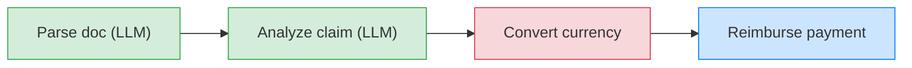
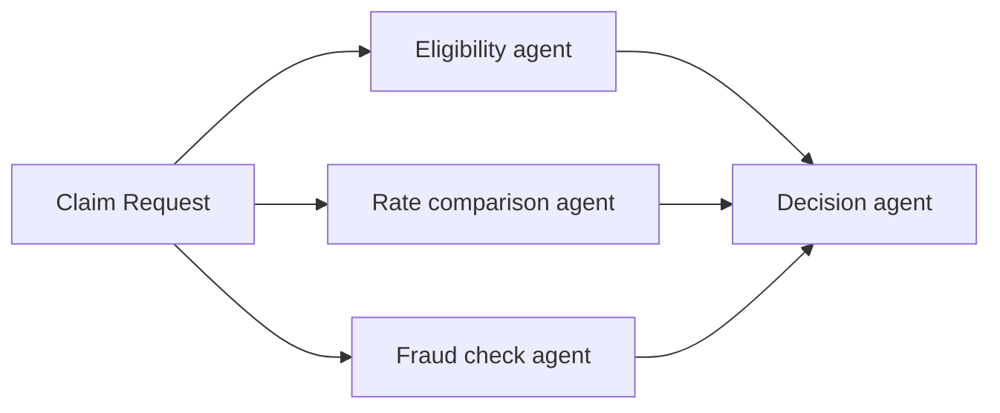
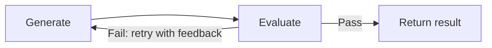
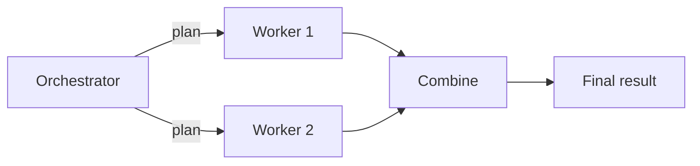

import {GlobalTabs, GlobalTab} from "/snippets/components/global-tabs.jsx";
import { GitHubLink } from '/snippets/blocks/github-link.mdx';
import SetupVercel from '/snippets/tour/ai/setup-vercel.mdx';
import SetupOpenAI from '/snippets/tour/ai/setup-openai.mdx';
import SetupGoogleADK from '/snippets/tour/ai/setup-google-adk.mdx';
import SetupRestateTS from '/snippets/common/setup-restate-ts.mdx';
import SetupRestatePy from '/snippets/common/setup-restate-py.mdx';

Real-world workflows often mix LLM-powered steps (parsing documents, analyzing data) with traditional steps (API calls, database writes, payments). Restate lets you chain these together in a single durable pipeline where each step is checkpointed. If the process crashes after step 2 of 4, recovery skips the completed steps and resumes from step 3.

<GlobalTabs>
<GlobalTab title="Vercel AI SDK" icon={"/img/languages/typescript.svg"}/>
<GlobalTab title="OpenAI Agents SDK" icon={"/img/languages/python.svg"}/>
<GlobalTab title="Google ADK" icon={"/img/languages/python.svg"}/>
<GlobalTab title="Restate TS SDK" icon={"/img/languages/typescript.svg"}/>
<GlobalTab title="Restate Py SDK" icon={"/img/languages/python.svg"}/>
</GlobalTabs>

## Sequential pipeline

Chain agentic and traditional steps in sequence. Restate records the result of each step, so on recovery:
- Completed steps are replayed instantly from the journal
- LLM calls are not repeated (saving cost and time)
- Regular steps (API calls, payments) are not duplicated



### Example: insurance claim reimbursement

This workflow processes an insurance claim through four steps: two agentic steps that use an LLM to understand unstructured data, and two traditional steps that call external APIs.

<GlobalTabs className={"hidden-tabs"}>
<GlobalTab title="Vercel AI SDK">

```typescript workflow-sequential.ts {"CODE_LOAD::https://raw.githubusercontent.com/restatedev/ai-examples/refs/heads/ai-structure/vercel-ai/tour-of-agents/src/workflow-sequential.ts#here"}
```

</GlobalTab>
<GlobalTab title="OpenAI Agents SDK">

```python workflow_sequential.py {"CODE_LOAD::https://raw.githubusercontent.com/restatedev/ai-examples/refs/heads/ai-structure/openai-agents/tour-of-agents/app/workflow_sequential.py#here"}
```

</GlobalTab>
<GlobalTab title="Google ADK">

```python workflow_sequential.py {"CODE_LOAD::https://raw.githubusercontent.com/restatedev/ai-examples/refs/heads/ai-structure/google-adk/tour-of-agents/app/workflow_sequential.py#here"}
```

</GlobalTab>
<GlobalTab title="Restate TS SDK">

This example chains three LLM calls: extract metrics from a report, sort them, and format as a table. Each step is wrapped in `ctx.run()` for durability.

```typescript chaining.ts {"CODE_LOAD::https://raw.githubusercontent.com/restatedev/ai-examples/refs/heads/main/typescript-patterns/src/chaining.ts#here"} 
async function process(ctx: Context, report: { message: string }) {
  // Step 1: Extract metrics
  const extract = await ctx.run(
    "Extract metrics",
    // Use your preferred LLM SDK here
    async () =>
      llmCall(`Extract numerical values and their metrics from the text. 
            Format as 'Metric Name: Value' per line. Input: ${report.message}`),
    { maxRetryAttempts: 3 },
  );

  // Step 2: Process the result from Step 1
  const sortedMetrics = await ctx.run(
    "Sort metrics",
    async () =>
      llmCall(`Sort lines in descending order by value: ${extract.text}`),
    { maxRetryAttempts: 3 },
  );

  // Step 3: Format as table
  const table = await ctx.run(
    "Format as table",
    async () =>
      llmCall(`Format the data as a markdown table: ${sortedMetrics.text}`),
    { maxRetryAttempts: 3 },
  );

  return table.text;
}
```
<GitHubLink url="https://github.com/restatedev/ai-examples/blob/main/typescript-patterns/src/chaining.ts" />

<Accordion title="Run this example" icon="laptop">
<SetupRestateTS />

Send a request:
```bash
curl localhost:8080/CallChainingService/process \
  --json '{"message": "Revenue: $5.2M, Employees: 142, Growth: 28%, Satisfaction: 94%"}'
```
</Accordion>

</GlobalTab>
<GlobalTab title="Restate Py SDK">

This example chains three LLM calls: extract metrics from a report, sort them, and format as a table. Each step is wrapped in `ctx.run()` for durability.

```python chaining.py {"CODE_LOAD::https://raw.githubusercontent.com/restatedev/ai-examples/refs/heads/main/python-patterns/app/chaining.py?collapse_prequel"} 
call_chaining_svc = restate.Service("CallChainingService")


@call_chaining_svc.handler()
async def process(ctx: restate.Context, report: Report) -> str | None:
    """Sequentially chains multiple LLM calls, each transforming the prior output."""

    # Step 1: Extract metrics
    extract = await ctx.run_typed(
        "Extract metrics",
        llm_call,  # Use your preferred LLM SDK here
        RunOptions(max_attempts=3),  # Avoid infinite retries
        messages=f"""Extract numerical values and their metrics from the text. 
        Format as 'Metric Name: Value' per line. Input: {report.message}""",
    )

    # Step 2: Sort by value
    sorted_metrics = await ctx.run_typed(
        "Sort metrics",
        llm_call,
        RunOptions(max_attempts=3),
        messages=f"Sort lines in descending order by value: {extract}",
    )

    # Step 3: Format as table
    table = await ctx.run_typed(
        "Format as table",
        llm_call,
        RunOptions(max_attempts=3),
        messages=f"Format the data as a markdown table:{sorted_metrics}",
    )

    return table.content
```
<GitHubLink url="https://github.com/restatedev/ai-examples/blob/main/python-patterns/app/chaining.py" />

<Accordion title="Run this example" icon="laptop">
<SetupRestatePy />

Send a request:
```bash
curl localhost:8080/CallChainingService/process \
  --json '{"message": "Revenue: $5.2M, Employees: 142, Growth: 28%, Satisfaction: 94%"}'
```
</Accordion>

</GlobalTab>
</GlobalTabs>

If the process crashes after the LLM analysis but before the payment, Restate recovers both LLM results from the journal and continues with the currency conversion. No LLM calls are repeated, no payments are duplicated.

## Parallel agents

Fan out work to multiple agents, then combine the results. Restate runs the agents in parallel with automatic retries and recovery. If one agent fails, only that agent is retried, the successful results are preserved.



### Example: parallel claim analysis

Three specialist agents analyze a claim concurrently. A decision agent combines their results.

<GlobalTabs className={"hidden-tabs"}>
<GlobalTab title="Vercel AI SDK">

```typescript workflow-parallel.ts {"CODE_LOAD::https://raw.githubusercontent.com/restatedev/ai-examples/refs/heads/ai-structure/vercel-ai/tour-of-agents/src/workflow-parallel.ts?collapse_prequel"} 
export default restate.service({
  name: "ParallelAgentClaimApproval",
  handlers: {
    run: async (ctx: restate.Context, claim: InsuranceClaim) => {
      const [eligibility, rateComparison, fraudCheck] =
        await RestatePromise.all([
          ctx.serviceClient(eligibilityAgent).run(claim),
          ctx.serviceClient(rateComparisonAgent).run(claim),
          ctx.serviceClient(fraudCheckAgent).run(claim),
        ]);

      const model = wrapLanguageModel({
        model: openai("gpt-4o"),
        middleware: durableCalls(ctx, { maxRetryAttempts: 3 }),
      });

      const { text } = await generateText({
        model,
        system: "You are a claim decision engine.",
        prompt: `Decide about claim ${JSON.stringify(claim)}. 
        Base your decision on the following analyses:
        Eligibility: ${eligibility}, Cost: ${rateComparison} Fraud: ${fraudCheck}`,
      });
      return text;
    },
  },
});
```
<GitHubLink url="https://github.com/restatedev/ai-examples/tree/ai-structure/vercel-ai/tour-of-agents/src/workflow-parallel.ts" />

<Accordion title="Try out parallel agents" icon="laptop">
<SetupVercel />
```bash
npx tsx ./src/workflow-parallel.ts
```

Register the agents with Restate:
```bash
restate deployments register http://localhost:9080
```

Start a request for a claim that needs to be analyzed by multiple agents in parallel:
```bash
curl localhost:8080/ParallelAgentClaimApproval/run --json '{
    "date":"2024-10-01",
    "category":"orthopedic",
    "reason":"hospital bill for a broken leg",
    "amount":3000,
    "placeOfService":"General Hospital"
}'
```

In the UI, you can see that the handler called the sub-agents in parallel.
Once all sub-agents return, the main agent makes a decision.

<Frame>

</Frame>
</Accordion>

</GlobalTab>
<GlobalTab title="OpenAI Agents SDK">

```python workflow_parallel.py {"CODE_LOAD::https://raw.githubusercontent.com/restatedev/ai-examples/refs/heads/ai-structure/openai-agents/tour-of-agents/app/workflow_parallel.py#here"} 
@agent_service.handler()
async def run(restate_context: restate.Context, claim: InsuranceClaim) -> str:
    # Start multiple agents in parallel with auto retries and recovery
    eligibility = restate_context.service_call(run_eligibility_agent, claim)
    cost = restate_context.service_call(run_rate_comparison_agent, claim)
    fraud = restate_context.service_call(run_fraud_agent, claim)

    # Wait for all responses
    await restate.gather(eligibility, cost, fraud)

    # Run decision agent on outputs
    result = await DurableRunner.run(
        Agent(
            name="ClaimApprovalAgent", instructions="You are a claim decision engine."
        ),
        input=f"Decide about claim: {claim.model_dump_json()}. "
        "Base your decision on the following analyses:"
        f"Eligibility: {await eligibility} Cost {await cost} Fraud: {await fraud}",
    )
    return result.final_output
```
<GitHubLink url="https://github.com/restatedev/ai-examples/blob/ai-structure/openai-agents/tour-of-agents/app/workflow_parallel.py" />

<Accordion title="Try out parallel agents" icon="laptop">
<SetupOpenAI />
```bash
uv run app/workflow_parallel.py
```

Register the agents with Restate:
```bash
restate deployments register http://localhost:9080
```

Start a request for a claim that needs to be analyzed by multiple agents in parallel:
```bash
curl localhost:8080/ParallelAgentClaimApproval/run --json '{
    "date":"2024-10-01",
    "category":"orthopedic",
    "reason":"hospital bill for a broken leg",
    "amount":3000,
    "placeOfService":"General Hospital"
}'
```

In the UI, you can see that the handler called the sub-agents in parallel.
Once all sub-agents return, the main agent makes a decision.

<Frame>

</Frame>
</Accordion>

</GlobalTab>
<GlobalTab title="Google ADK">

```python workflow_parallel.py {"CODE_LOAD::https://raw.githubusercontent.com/restatedev/ai-examples/refs/heads/ai-structure/google-adk/tour-of-agents/app/workflow_parallel.py#here"} 
@agent_service.handler()
async def run(ctx: restate.ObjectContext, claim: InsuranceClaim) -> str | None:

    # Start multiple agents in parallel with auto retries and recovery
    eligibility = ctx.service_call(run_eligibility_agent, claim)
    cost = ctx.service_call(run_rate_comparison_agent, claim)
    fraud = ctx.service_call(run_fraud_agent, claim)

    # Wait for all responses
    await restate.gather(eligibility, cost, fraud)

    # Get the results
    eligibility_result = await eligibility
    cost_result = await cost
    fraud_result = await fraud

    # Run decision agent on outputs
    prompt = f"""Decide about claim: {claim.model_dump_json()}. Assessments:
    Eligibility: {eligibility_result} Cost: {cost_result} Fraud: {fraud_result}"""

    events = runner.run_async(
        user_id=ctx.key(),
        session_id=claim.session_id,
        new_message=Content(role="user", parts=[Part.from_text(text=prompt)]),
    )

    final_response = None
    async for event in events:
        if event.is_final_response() and event.content and event.content.parts:
            if event.content.parts[0].text:
                final_response = event.content.parts[0].text
    return final_response
```
<GitHubLink url="https://github.com/restatedev/ai-examples/blob/ai-structure/google-adk/tour-of-agents/app/workflow_parallel.py" />

<Accordion title="Try out parallel agents" icon="laptop">
<SetupGoogleADK />
```bash
uv run app/workflow_parallel.py
```

Register the agents with Restate:
```bash
restate deployments register http://localhost:9080
```

Start a request for a claim that needs to be analyzed by multiple agents in parallel:
```bash
curl localhost:8080/ParallelAgentClaimApproval/user123/run --json '{
    "amount": 3000,
    "category": "orthopedic",
    "date": "2024-10-01",
    "placeOfService": "General Hospital",
    "reason": "hospital bill for a broken leg",
    "sessionId": "session-123"
}'
```

In the UI, you can see that the handler called the sub-agents in parallel.
Once all sub-agents return, the main agent makes a decision.

<Frame>

</Frame>
</Accordion>

</GlobalTab>
<GlobalTab title="Restate TS SDK">

This example runs three independent analysis tasks (sentiment, key points, summary) in parallel using `RestatePromise.all()`.

```typescript parallel-agents.ts {"CODE_LOAD::https://raw.githubusercontent.com/restatedev/ai-examples/refs/heads/main/typescript-patterns/src/parallel-agents.ts#here"} 
async function analyze(ctx: Context, { message }: { message: string }) {
  // Create parallel tasks - each runs independently
  const tasks = [
    ctx.run(
      "Analyze sentiment",
      // Use your preferred LLM SDK here
      async () => llmCall(`Analyze sentiment: ${message}`),
      { maxRetryAttempts: 3 },
    ),
    ctx.run(
      "Extract key points",
      async () => llmCall(`Extract 3 key points as bullets: ${message}`),
      { maxRetryAttempts: 3 },
    ),
    ctx.run(
      "Summarize",
      async () => llmCall(`Summarize in one sentence: ${message}`),
      { maxRetryAttempts: 3 },
    ),
  ];

  // Wait for all tasks to complete and return the results
  const results = await RestatePromise.all(tasks);
  return results.map((res) => res.text);
}
```
<GitHubLink url="https://github.com/restatedev/ai-examples/blob/main/typescript-patterns/src/parallel-agents.ts" />

<Accordion title="Run this example" icon="laptop">
<SetupRestateTS />

Send a request:
```bash
curl localhost:8080/ParallelAgentsService/analyze \
  --json '{"message": "Restate provides durable execution for distributed applications."}'
```
</Accordion>

</GlobalTab>
<GlobalTab title="Restate Py SDK">

This example runs three independent analysis tasks (sentiment, key points, summary) in parallel using `restate.gather()`.

```python workflow_parallel.py {"CODE_LOAD::https://raw.githubusercontent.com/restatedev/ai-examples/refs/heads/main/python-patterns/app/workflow_parallel.py?collapse_prequel"} 
parallelization_svc = restate.Service("ParallelAgentsService")


@parallelization_svc.handler()
async def analyze(ctx: restate.Context, text: Text) -> list[str | None]:
    """Analyzes multiple aspects of the text in parallel."""

    # Create parallel tasks - each runs independently
    tasks = [
        ctx.run_typed(
            "Analyze sentiment",
            llm_call,  # Use your preferred LLM SDK here
            RunOptions(max_attempts=3),
            messages=f"Analyze sentiment (positive/negative/neutral): {text}",
        ),
        ctx.run_typed(
            "Extract key points",
            llm_call,
            RunOptions(max_attempts=3),
            messages=f"Extract 3 key points as bullets: {text}",
        ),
        ctx.run_typed(
            "Summarize",
            llm_call,
            RunOptions(max_attempts=3),
            messages=f"Summarize in one sentence: {text}",
        ),
    ]

    # Wait for all tasks to complete
    await restate.gather(*tasks)

    # Gather and collect results
    return [(await task).content for task in tasks]
```
<GitHubLink url="https://github.com/restatedev/ai-examples/blob/main/python-patterns/app/workflow_parallel.py" />

<Accordion title="Run this example" icon="laptop">
<SetupRestatePy />

Send a request:
```bash
curl localhost:8080/ParallelAgentsService/analyze \
  --json '{"message": "Restate provides durable execution for distributed applications."}'
```
</Accordion>

</GlobalTab>
</GlobalTabs>


## Evaluation feedback loop

Have an agent generate output, then evaluate it with a second LLM call and loop until the quality meets your criteria. Restate persists each iteration, so if the process crashes, it resumes from the last completed evaluation without re-running earlier iterations.



### Example: code generation with quality check

A generator agent writes code, then an evaluator agent checks it. If the evaluation fails, the generator retries with the feedback. Each iteration is a durable step.

<GlobalTabs className={"hidden-tabs"}>
<GlobalTab title="Vercel AI SDK">

```typescript workflow-evaluator-optimizer.ts {"CODE_LOAD::https://raw.githubusercontent.com/restatedev/ai-examples/refs/heads/ai-structure/vercel-ai/tour-of-agents/src/workflow-evaluator-optimizer.ts#here"}
```

</GlobalTab>
<GlobalTab title="OpenAI Agents SDK">

```python workflow_evaluator_optimizer.py {"CODE_LOAD::https://raw.githubusercontent.com/restatedev/ai-examples/refs/heads/ai-structure/openai-agents/tour-of-agents/app/workflow_evaluator_optimizer.py#here"}
```

</GlobalTab>
<GlobalTab title="Google ADK">

```python workflow_evaluator_optimizer.py {"CODE_LOAD::https://raw.githubusercontent.com/restatedev/ai-examples/refs/heads/ai-structure/google-adk/tour-of-agents/app/workflow_evaluator_optimizer.py#here"}
```

</GlobalTab>
<GlobalTab title="Restate TS SDK">

```typescript evaluator-optimizer.ts {"CODE_LOAD::https://raw.githubusercontent.com/restatedev/ai-examples/refs/heads/main/typescript-patterns/src/evaluator-optimizer.ts#here"} 
async function run(ctx: Context, { message }: { message: string }) {
  let solution: string | null = null;
  const attempts: string[] = [];

  for (let i = 0; i < maxIterations; i++) {
    // Generate solution (with context from previous attempts)
    const taskPrompt = `Task: ${message} - Previous attempts: ${attempts.join(", ")}`;
    const solution = await ctx.run(
      `Generate v${i}`,
      // Use your preferred LLM SDK here
      async () => llmCall(taskPrompt).then((res) => res.text),
      { maxRetryAttempts: 3 },
    );
    attempts.push(solution);

    // Evaluate the solution
    const evalPrompt = `${evaluationPrompt} Task: ${message} - Solution: ${solution}`;
    const evaluation = await ctx.run(
      `Evaluate v${i}`,
      async () => llmCall(evalPrompt).then((res) => res.text),
      { maxRetryAttempts: 3 },
    );
    printEvaluation(i, solution, evaluation);

    if (evaluation && evaluation.startsWith("PASS")) {
      return solution;
    }
  }

  return `Max iterations reached. Best attempt:\n${solution}`;
}
```
<GitHubLink url="https://github.com/restatedev/ai-examples/blob/main/typescript-patterns/src/evaluator-optimizer.ts" />

<Accordion title="Run this example" icon="laptop">
<SetupRestateTS />

Send a request:
```bash
curl localhost:8080/CodeGenerator/generate \
  --json '{"task": "Write a function that checks if a string is a palindrome"}'
```
</Accordion>

</GlobalTab>
<GlobalTab title="Restate Py SDK">

```python evaluator_optimizer.py {"CODE_LOAD::https://raw.githubusercontent.com/restatedev/ai-examples/refs/heads/main/python-patterns/app/evaluator_optimizer.py#here"} 
"""
Evaluator-Optimizer Pattern

Generate → Evaluate → Improve loop until quality criteria are met.
Restate persists each iteration, resuming from the last completed step on failure.

Generate → Evaluate → [Pass/Improve] → Final Result
"""

import restate
from pydantic import BaseModel
from restate import RunOptions

from .util.litellm_call import llm_call
from .util.util import print_evaluation

max_iterations = 5

example_prompt = """Write a Python function that finds the longest palindromic substring in a string. 
It should be efficient and handle edge cases."""

evaluation_prompt = """Evaluate this solution on correctness, efficiency, and readability. 
            Reply with either:
            'PASS: [brief reason]' if the solution is correct and very well-implemented
            'IMPROVE: [specific issues to fix]' if it needs work"""


class Task(BaseModel):
    message: str = example_prompt


evaluator_optimizer = restate.Service("EvaluatorOptimizer")


@evaluator_optimizer.handler()
async def run(ctx: restate.Context, task: Task) -> str | None:
    """Iteratively improve a solution until it meets quality standards."""

    solution: str | None = None
    attempts: list[str] = []

    for iteration in range(max_iterations):
        # Generate solution (with context from previous attempts)
        solution_response = await ctx.run_typed(
            f"generate_v{iteration+1}",
            llm_call,  # Use your preferred LLM SDK here
            RunOptions(max_attempts=3),
            messages=f"Task: {task} - Previous attempts: {attempts}",
        )
        solution = solution_response.content
        if solution is not None:
            attempts.append(solution)

        # Evaluate the solution
        evaluation_response = await ctx.run_typed(
            f"evaluate_v{iteration+1}",
            llm_call,
            RunOptions(max_attempts=3),
            messages=f"{evaluation_prompt} Task: {task} - Solution: {solution}",
        )
        evaluation = evaluation_response.content
        print_evaluation(iteration, solution, evaluation)

        if evaluation and evaluation.startswith("PASS"):
            return solution

    return f"Max iterations reached. Best attempt:\n {solution}"
```
<GitHubLink url="https://github.com/restatedev/ai-examples/blob/main/python-patterns/app/evaluator_optimizer.py" />

<Accordion title="Run this example" icon="laptop">
<SetupRestatePy />

Send a request:
```bash
curl localhost:8080/CodeGenerator/generate \
  --json '{"task": "Write a function that checks if a string is a palindrome"}'
```
</Accordion>

</GlobalTab>
</GlobalTabs>

Each generate and evaluate call is persisted in the journal. If the process crashes after a successful generation but before evaluation, the generated code is replayed from the journal without calling the LLM again.

## Orchestrator-worker

An orchestrator agent dynamically decides what tasks to dispatch, and worker agents execute them. The orchestrator can plan, delegate, and combine results in any order. Restate ensures the orchestrator's plan and each worker's result are durably persisted.



### Example: research report generation

An orchestrator agent breaks a research topic into sub-tasks, dispatches them to worker agents, and combines the results into a report.

<GlobalTabs className={"hidden-tabs"}>
<GlobalTab title="Vercel AI SDK">

```typescript workflow-orchestrator.ts {"CODE_LOAD::https://raw.githubusercontent.com/restatedev/ai-examples/refs/heads/ai-structure/vercel-ai/tour-of-agents/src/workflow-orchestrator.ts#here"}
```

</GlobalTab>
<GlobalTab title="OpenAI Agents SDK">

```python workflow_orchestrator.py {"CODE_LOAD::https://raw.githubusercontent.com/restatedev/ai-examples/refs/heads/ai-structure/openai-agents/tour-of-agents/app/workflow_orchestrator.py#here"}
```

</GlobalTab>
<GlobalTab title="Google ADK">

```python workflow_orchestrator.py {"CODE_LOAD::https://raw.githubusercontent.com/restatedev/ai-examples/refs/heads/ai-structure/google-adk/tour-of-agents/app/workflow_orchestrator.py#here"}
```

</GlobalTab>
<GlobalTab title="Restate TS SDK">

```typescript orchestrator-workers.ts {"CODE_LOAD::https://raw.githubusercontent.com/restatedev/ai-examples/refs/heads/main/typescript-patterns/src/orchestrator-workers.ts#here"}
```
<GitHubLink url="https://github.com/restatedev/ai-examples/blob/main/typescript-patterns/src/orchestrator-workers.ts" />

<Accordion title="Run this example" icon="laptop">
<SetupRestateTS />

Send a request:
```bash
curl localhost:8080/ResearchReport/generate \
  --json '{"topic": "The impact of renewable energy on global economies"}'
```
</Accordion>

</GlobalTab>
<GlobalTab title="Restate Py SDK">

```python orchestrator_workers.py {"CODE_LOAD::https://raw.githubusercontent.com/restatedev/ai-examples/refs/heads/main/python-patterns/app/orchestrator_workers.py#here"} 
"""
Orchestrator-Worker Pattern

Break down complex tasks into specialized subtasks and execute them in parallel.
If any worker fails, Restate retries only that worker while preserving other completed work.

Task → Orchestrator → [Worker A, Worker B, Worker C] → Aggregated Results
"""

import litellm
import restate

from pydantic import BaseModel
from restate import RunOptions

from .util.litellm_call import llm_call
from .util.util import parse_task_list, TaskList

litellm.enable_json_schema_validation = True

example_prompt = """Analyze the following text for sentiment, key points, and provide a summary:
'Our Q3 results exceeded all expectations! Customer satisfaction reached 95%, 
revenue grew by 40% year-over-year, and we successfully launched three new product features. 
The team worked incredibly hard to deliver these outcomes despite supply chain challenges. 
Our market share increased to 23%, and we're well-positioned for continued growth in Q4.'"""


class Prompt(BaseModel):
    message: str = example_prompt


orchestrator_svc = restate.Service("Orchestrator")


@orchestrator_svc.handler()
async def process(ctx: restate.Context, prompt: Prompt) -> str:
    """Orchestrate text analysis breakdown and parallel execution by specialized workers."""

    # Step 1: Orchestrator analyzes and breaks down the text analysis task
    async def generate_task_list() -> TaskList:
        content = f"""You are an orchestrator that breaks down text analysis tasks into specialized subtasks for workers.
        Analyze the following text: {prompt.message}"""
        resp = await litellm.acompletion(
            model="gpt-4o",
            messages=[{"role": "user", "content": content}],
            response_format=TaskList,
        )
        return parse_task_list(resp)

    response = await ctx.run_typed(
        "orchestrator_analysis",
        generate_task_list,  # Use your preferred LLM SDK here
        RunOptions(max_attempts=3),
    )

    # Step 2: Workers execute their specialized tasks in parallel
    task_promises = []
    for task in response.tasks:
        worker_task = ctx.run_typed(
            task.task_type,
            llm_call,  # Use your preferred LLM SDK here
            RunOptions(max_attempts=3),
            messages=f"""You are a {task.task_type} specialist."
            Task: {task.instruction} - Text to analyze: {prompt}""",
        )
        task_promises.append(worker_task)

    # Wait for all workers to complete
    await restate.gather(*task_promises)

    # Collect results
    results = [
        f"{task.task_type} result: {(await task_promise).content}"
        for task, task_promise in zip(response.tasks, task_promises)
    ]
    return "\n\n--".join(results)
```
<GitHubLink url="https://github.com/restatedev/ai-examples/blob/main/python-patterns/app/orchestrator_workers.py" />

<Accordion title="Run this example" icon="laptop">
<SetupRestatePy />

Send a request:
```bash
curl localhost:8080/ResearchReport/generate \
  --json '{"topic": "The impact of renewable energy on global economies"}'
```
</Accordion>

</GlobalTab>
</GlobalTabs>

The orchestrator's plan is persisted as a durable step. If the process crashes after two of four workers have completed, recovery replays those two results from the journal and only runs the remaining two workers.