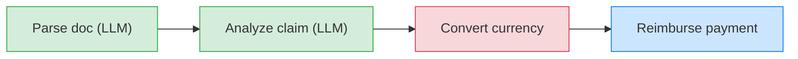
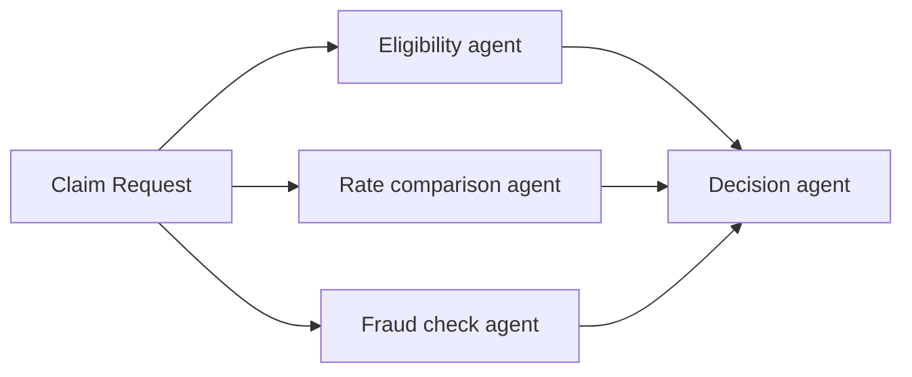
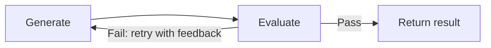
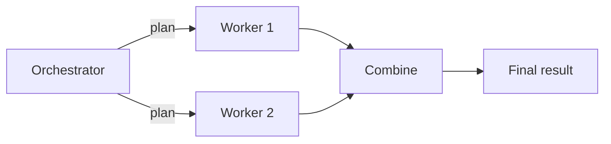

import {GlobalTabs, GlobalTab} from "/snippets/components/global-tabs.jsx";
import { GitHubLink } from '/snippets/blocks/github-link.mdx';
import SetupVercel from '/snippets/tour/ai/setup-vercel.mdx';
import SetupOpenAI from '/snippets/tour/ai/setup-openai.mdx';
import SetupGoogleADK from '/snippets/tour/ai/setup-google-adk.mdx';
import SetupRestateTS from '/snippets/common/setup-restate-ts.mdx';
import SetupRestatePy from '/snippets/common/setup-restate-py.mdx';

Real-world workflows often mix LLM-powered steps (parsing documents, analyzing data) with traditional steps (API calls, database writes, payments). Restate lets you chain these together in a single durable pipeline where each step is checkpointed. If the process crashes after step 2 of 4, recovery skips the completed steps and resumes from step 3.

<GlobalTabs>
<GlobalTab title="Vercel AI" icon={"/img/languages/typescript.svg"}/>
<GlobalTab title="OpenAI Agents" icon={"/img/languages/python.svg"}/>
<GlobalTab title="Google ADK" icon={"/img/languages/python.svg"}/>
<GlobalTab title="Restate TS" icon={"/img/languages/typescript.svg"}/>
<GlobalTab title="Restate Py" icon={"/img/languages/python.svg"}/>
</GlobalTabs>

## Sequential pipeline

Chain agentic and traditional steps in sequence. Restate records the result of each step, so on recovery:
- Completed steps are replayed instantly from the journal
- LLM calls are not repeated (saving cost and time)
- Regular steps (API calls, payments) are not duplicated



### Example: insurance claim reimbursement

This workflow processes an insurance claim through four steps: two agentic steps that use an LLM to understand unstructured data, and two traditional steps that call external APIs.

<GlobalTabs className={"hidden-tabs"}>
<GlobalTab title="Vercel AI">

```typescript workflow-sequential.ts {"CODE_LOAD::https://raw.githubusercontent.com/restatedev/ai-examples/refs/heads/ai-structure/vercel-ai/tour-of-agents/src/workflow-sequential.ts#here"} 
const process = async (ctx: Context, {prompt}: {prompt: string}) => {
  const model = wrapLanguageModel({
    model: openai("gpt-4o"),
    middleware: durableCalls(ctx, { maxRetryAttempts: 3 }),
  });

  // Step 1: Parse the claim document (LLM step)
  const { output } = await generateText({
    model,
    system:
      "Extract the claim amount, currency, category, and description.",
    prompt,
    output: Output.object({schema: ClaimData})
  });

  // Step 2: Analyze the claim (LLM step)
  const { output: valid } = await generateText({
    model,
    system:
      "You are a claims analyst. Assess whether this claim is valid and determine the approved amount.",
    prompt: `Claim: ${JSON.stringify(output)}`,
    output: Output.object({schema: z.object({valid: z.boolean()})}),
  });

  if (!valid) {
    return { analysis: "Claim is invalid", amountUsd: 0, confirmation: false };
  }

  // Step 3: Convert currency (regular step)
  const amountUsd = await ctx.run("Convert currency", async () =>
    convertCurrency(output.amount, output.currency, "USD"),
  );

  // Step 4: Process reimbursement (regular step)
  const confirmation = await ctx.run("Process payment", async () =>
    processPayment(ctx.rand.uuidv4(), amountUsd),
  );

  return { analysis: "Claim is valid", amountUsd, confirmation };
};
```
<GitHubLink url="https://github.com/restatedev/ai-examples/blob/ai-structure/vercel-ai/tour-of-agents/src/workflow-sequential.ts" />

<Accordion title="Run this example" icon="laptop">
<SetupVercel />
```bash
npx tsx ./src/workflow-sequential.ts
```

Register the agents with Restate:
```bash
restate deployments register http://localhost:9080 --force --yes # dev only: overrides previous registrations
```

Send a request to the agent:
```shell
curl localhost:8080/ClaimReimbursement/process --json '{
    "prompt": "Process my hospital bill of 2024-10-01 for 3000USD for a broken leg at General Hospital."
}'
```
</Accordion>

</GlobalTab>
<GlobalTab title="OpenAI Agents">

```python workflow_sequential.py {"CODE_LOAD::https://raw.githubusercontent.com/restatedev/ai-examples/refs/heads/ai-structure/openai-agents/tour-of-agents/app/workflow_sequential.py#here"} 
claim_service = restate.Service("ClaimReimbursement")


@claim_service.handler()
async def process(ctx: restate.Context, req: ClaimPrompt) -> dict:
    # Step 1: Parse the claim document (LLM step)
    parse_agent = Agent(
        name="DocumentParser",
        instructions="Extract the claim amount, currency, category, and description.",
        output_type=ClaimData
    )
    parsed = await DurableRunner.run(parse_agent, req.message)
    claim = parsed.final_output

    # Step 2: Analyze the claim (LLM step)
    analysis_agent = Agent(
        name="ClaimsAnalyst",
        instructions="Assess whether this claim is valid and determine the approved amount.",
    )
    analysis = await DurableRunner.run(analysis_agent, f"Claim: {parsed.final_output.model_dump_json()}")

    # Step 3: Convert currency (regular step)
    amount_usd = await ctx.run_typed(
        "Convert currency",
        convert_currency,
        amount=claim.amount,
        source=claim.currency,
        target="USD",
    )

    # Step 4: Process reimbursement (regular step)
    confirmation = await ctx.run_typed(
        "Process payment",
        process_payment,
        claim_id=str(ctx.uuid()),
        amount=amount_usd,
    )

    return {
        "analysis": analysis.final_output,
        "amount_usd": amount_usd,
        "confirmation": confirmation,
    }
```
<GitHubLink url="https://github.com/restatedev/ai-examples/blob/ai-structure/openai-agents/tour-of-agents/app/workflow_sequential.py" />

<Accordion title="Run this example" icon="laptop">
<SetupOpenAI />
```bash
uv run app/workflow_sequential.py
```

Register the agents with Restate:
```bash
restate deployments register http://localhost:9080 --force --yes # dev only: overrides previous registrations
```

Send a request:
```bash
curl localhost:8080/ClaimReimbursement/process --json '{
    "message": "Process my hospital bill of 2024-10-01 for 3000USD for a broken leg at General Hospital."
}'
```
</Accordion>

</GlobalTab>
<GlobalTab title="Google ADK">

```python workflow_sequential.py {"CODE_LOAD::https://raw.githubusercontent.com/restatedev/ai-examples/refs/heads/ai-structure/google-adk/tour-of-agents/app/workflow_sequential.py#here"} 
parse_agent = Agent(
    model="gemini-2.5-flash",
    name="document_parser",
    instruction="Extract the claim amount, currency, category, and description.",
    output_schema=ClaimData
)
parse_app = App(name="claims", root_agent=parse_agent, plugins=[RestatePlugin()])
parse_runner = Runner(app=parse_app, session_service=RestateSessionService())

analysis_agent = Agent(
    model="gemini-2.5-flash",
    name="claims_analyst",
    instruction="Assess whether this claim is valid and determine the approved amount.",
)
analysis_app = App(name="claims", root_agent=analysis_agent, plugins=[RestatePlugin()])
analysis_runner = Runner(app=analysis_app, session_service=RestateSessionService())

claim_service = restate.VirtualObject("ClaimReimbursement")


@claim_service.handler()
async def process(ctx: restate.ObjectContext, req: ClaimPrompt) -> dict:
    # Step 1: Parse the claim document (LLM step)
    parsing_events = parse_runner.run_async(
        user_id=ctx.key(),
        session_id=req.session_id,
        new_message=Content(role="user", parts=[Part.from_text(text=req.message)]),
    )
    parsed = await parse_agent_response(parsing_events)
    claim = ClaimData.model_validate_json(parsed)

    # Step 2: Analyze the claim (LLM step)
    analysis_events = analysis_runner.run_async(
        user_id=ctx.key(),
        session_id=req.session_id,
        new_message=Content(role="user", parts=[Part.from_text(text=parsed)]),
    )
    analysis = await parse_agent_response(analysis_events)

    # Step 3: Convert currency (regular step)
    amount_usd = await ctx.run_typed(
        "Convert currency", convert_currency,
        amount=claim.amount, source=claim.currency, target="USD",
    )

    # Step 4: Process reimbursement (regular step)
    confirmation = await ctx.run_typed(
        "Process payment", process_payment,
        claim_id=str(ctx.uuid()), amount=amount_usd,
    )

    return {"analysis": analysis, "amount_usd": amount_usd, "confirmation": confirmation}
```
<GitHubLink url="https://github.com/restatedev/ai-examples/blob/ai-structure/google-adk/tour-of-agents/app/workflow_sequential.py" />

<Accordion title="Run this example" icon="laptop">
<SetupGoogleADK />
```bash
uv run app/workflow_sequential.py
```

Register the agents with Restate:
```bash
restate deployments register http://localhost:9080 --force --yes # dev only: overrides previous registrations
```

Send a request:
```bash
curl localhost:8080/ClaimReimbursement/user123/process \
  --json '{
    "sessionId": "session-123",
    "message": "Hospital bill for a broken leg. Amount: 3000 EUR. Date: 2024-10-01. Hospital: General Hospital."
  }'
```
</Accordion>

</GlobalTab>
<GlobalTab title="Restate TS">

```typescript workflow-sequential.ts {"CODE_LOAD::https://raw.githubusercontent.com/restatedev/ai-examples/refs/heads/ai-structure/typescript-restate-only/tour-of-agents/src/workflow-sequential.ts#here"} 
async function process(ctx: Context, { message }: { message: string }) {
  // Step 1: Parse the claim document (LLM step)
  const { output } = await ctx.run(
    "Parse claim",
    async () => {
      const { output } = await generateText({
        model: openai("gpt-4o"),
        prompt: `Extract the claim amount, currency, category, and description. Input: ${message}`,
        output: Output.object({ schema: ClaimData }),
      });
      return { output };
    },
    { maxRetryAttempts: 3 },
  );

  // Step 2: Evaluate the claim (LLM step)
  const { valid } = await ctx.run(
    "Evaluate claim",
    async () => {
      const { output: valid } = await generateText({
        model: openai("gpt-4o"),
        system:
          "You are a claims analyst. Assess whether this claim is valid and determine the approved amount.",
        prompt: `Claim: ${JSON.stringify(output)}`,
        output: Output.object({schema: z.object({valid: z.boolean()})}),
      });
      return valid;
    },
    { maxRetryAttempts: 3 },
  );

  if (!valid) {
    return { analysis: "Claim is invalid", amountUsd: 0, confirmation: false };
  }

  // Step 3: Convert currency (regular step)
  const amountUsd = await ctx.run("Convert currency", async () =>
    convertCurrency(output.amount, output.currency, "USD"),
  );

  // Step 4: Process reimbursement (regular step)
  const confirmation = await ctx.run("Process payment", async () =>
    processPayment(ctx.rand.uuidv4(), amountUsd),
  );

  return { analysis: "Claim is valid", amountUsd, confirmation };
}
```
<GitHubLink url="https://github.com/restatedev/ai-examples/blob/ai-structure/typescript-restate-only/tour-of-agents/src/workflow-sequential.ts" />

<Accordion title="Run this example" icon="laptop">
<SetupRestateTS />

```bash
npx tsx ./src/workflow-sequential.ts
```

Register the services with Restate:
```bash
restate deployments register http://localhost:9080 --force --yes # dev only: overrides previous registrations
```

Send a request:
```bash
curl localhost:8080/ClaimReimbursement/process --json '{
    "message": "Process my hospital bill of 2024-10-01 for 3000USD for a broken leg at General Hospital."
}'
```
</Accordion>

</GlobalTab>
<GlobalTab title="Restate Py">

```python workflow_sequential.py {"CODE_LOAD::https://raw.githubusercontent.com/restatedev/ai-examples/refs/heads/ai-structure/python-restate-only/tour-of-agents/app/workflow_sequential.py#here"} 
claim_service = restate.Service("ClaimReimbursement")


@claim_service.handler()
async def process(ctx: restate.Context, req: ClaimPrompt) -> dict:
    """Sequentially chains LLM calls with regular function calls to process a claim."""

    # Step 1: Parse the claim document (LLM step)
    parsed = await ctx.run_typed(
        "Parse claim document",
        llm_call,
        RunOptions(max_attempts=3),
        messages=f"""Extract the claim amount, currency, category, and description.
        Document: {req.message}""",
        response_format=ClaimData,
    )
    claim = ClaimData.model_validate_json(parsed.content)

    # Step 2: Analyze the claim (LLM step)
    response = await ctx.run_typed(
        "Evaluate claim",
        llm_call,
        RunOptions(max_attempts=3),
        messages=f"""Assess whether this claim is valid and determine the approved amount.
        Claim: {parsed.content}""",
        response_format=ClaimEvaluation,
    )
    evaluation = ClaimEvaluation.model_validate_json(response.content)
    if not evaluation.valid:
        return {"analysis": "Claim is invalid."}


    # Step 3: Convert currency (regular step)
    amount_usd = await ctx.run_typed(
        "Convert currency",
        convert_currency,
        amount=claim.amount,
        source=claim.currency,
        target="USD",
    )

    # Step 4: Process reimbursement (regular step)
    confirmation = await ctx.run_typed(
        "Process payment",
        process_payment,
        claim_id=str(ctx.uuid()),
        amount=amount_usd,
    )

    return {
        "analysis": "Claim is valid.",
        "amount_usd": amount_usd,
        "confirmation": confirmation,
    }
```
<GitHubLink url="https://github.com/restatedev/ai-examples/blob/ai-structure/python-restate-only/tour-of-agents/app/workflow_sequential.py" />

<Accordion title="Run this example" icon="laptop">
<SetupRestatePy />
```bash
uv run app/workflow_sequential.py
```

Register the services with Restate:
```bash
restate deployments register http://localhost:9080 --force --yes # dev only: overrides previous registrations
```

Send a request:
```bash
curl localhost:8080/ClaimReimbursement/process --json '{
    "message": "Process my hospital bill of 2024-10-01 for 3000USD for a broken leg at General Hospital."
}'
```
</Accordion>

</GlobalTab>
</GlobalTabs>

If the process crashes after the LLM analysis but before the payment, Restate recovers both LLM results from the journal and continues with the currency conversion. No LLM calls are repeated, no payments are duplicated.

## Parallel agents

Fan out work to multiple agents, then combine the results. Restate runs the agents in parallel with automatic retries and recovery. If one agent fails, only that agent is retried, the successful results are preserved.



### Example: parallel claim analysis

Three specialist agents analyze a claim concurrently. A decision agent combines their results.

<GlobalTabs className={"hidden-tabs"}>
<GlobalTab title="Vercel AI">

```typescript workflow-parallel.ts {"CODE_LOAD::https://raw.githubusercontent.com/restatedev/ai-examples/refs/heads/ai-structure/vercel-ai/tour-of-agents/src/workflow-parallel.ts#here"} 
const run = async (ctx: restate.Context, claim: ClaimInput) => {
  const [eligibility, rateComparison, fraudCheck] = await RestatePromise.all([
    ctx.serviceClient(eligibilityAgent).run(claim),
    ctx.serviceClient(rateComparisonAgent).run(claim),
    ctx.serviceClient(fraudCheckAgent).run(claim),
  ]);

  const model = wrapLanguageModel({
    model: openai("gpt-4o"),
    middleware: durableCalls(ctx, { maxRetryAttempts: 3 }),
  });

  const { text } = await generateText({
    model,
    system: "You are a claim decision engine.",
    prompt: `Decide about claim ${JSON.stringify(claim)}.
        Base your decision on the following analyses:
        Eligibility: ${eligibility}, Cost: ${rateComparison} Fraud: ${fraudCheck}`,
  });
  return text;
};
```
<GitHubLink url="https://github.com/restatedev/ai-examples/tree/ai-structure/vercel-ai/tour-of-agents/src/workflow-parallel.ts" />

<Accordion title="Try out parallel agents" icon="laptop">
<SetupVercel />
```bash
npx tsx ./src/workflow-parallel.ts
```

Register the agents with Restate:
```bash
restate deployments register http://localhost:9080 --force --yes # dev only: overrides previous registrations
```

Start a request for a claim that needs to be analyzed by multiple agents in parallel:
```bash
curl localhost:8080/ParallelAgentClaimApproval/run --json '{
    "date":"2024-10-01",
    "category":"orthopedic",
    "reason":"hospital bill for a broken leg",
    "amount":3000,
    "placeOfService":"General Hospital"
}'
```

In the UI, you can see that the handler called the sub-agents in parallel.
Once all sub-agents return, the main agent makes a decision.

<Frame>

</Frame>
</Accordion>

</GlobalTab>
<GlobalTab title="OpenAI Agents">

```python workflow_parallel.py {"CODE_LOAD::https://raw.githubusercontent.com/restatedev/ai-examples/refs/heads/ai-structure/openai-agents/tour-of-agents/app/workflow_parallel.py#here"} 
@agent_service.handler()
async def run(restate_context: restate.Context, claim: InsuranceClaim) -> str:
    # Start multiple agents in parallel with auto retries and recovery
    eligibility = restate_context.service_call(run_eligibility_agent, claim)
    cost = restate_context.service_call(run_rate_comparison_agent, claim)
    fraud = restate_context.service_call(run_fraud_agent, claim)

    # Wait for all responses
    await restate.gather(eligibility, cost, fraud)

    # Run decision agent on outputs
    result = await DurableRunner.run(
        Agent(
            name="ClaimApprovalAgent", instructions="You are a claim decision engine."
        ),
        input=f"Decide about claim: {claim.model_dump_json()}. "
        "Base your decision on the following analyses:"
        f"Eligibility: {await eligibility} Cost {await cost} Fraud: {await fraud}",
    )
    return result.final_output
```
<GitHubLink url="https://github.com/restatedev/ai-examples/blob/ai-structure/openai-agents/tour-of-agents/app/workflow_parallel.py" />

<Accordion title="Try out parallel agents" icon="laptop">
<SetupOpenAI />
```bash
uv run app/workflow_parallel.py
```

Register the agents with Restate:
```bash
restate deployments register http://localhost:9080 --force --yes # dev only: overrides previous registrations
```

Start a request for a claim that needs to be analyzed by multiple agents in parallel:
```bash
curl localhost:8080/ParallelAgentClaimApproval/run --json '{
    "date":"2024-10-01",
    "category":"orthopedic",
    "reason":"hospital bill for a broken leg",
    "amount":3000,
    "placeOfService":"General Hospital"
}'
```

In the UI, you can see that the handler called the sub-agents in parallel.
Once all sub-agents return, the main agent makes a decision.

<Frame>

</Frame>
</Accordion>

</GlobalTab>
<GlobalTab title="Google ADK">

```python workflow_parallel.py {"CODE_LOAD::https://raw.githubusercontent.com/restatedev/ai-examples/refs/heads/ai-structure/google-adk/tour-of-agents/app/workflow_parallel.py#here"} 
@agent_service.handler()
async def run(ctx: restate.ObjectContext, claim: InsuranceClaim) -> str | None:

    # Start multiple agents in parallel with auto retries and recovery
    eligibility = ctx.service_call(run_eligibility_agent, claim)
    cost = ctx.service_call(run_rate_comparison_agent, claim)
    fraud = ctx.service_call(run_fraud_agent, claim)

    # Wait for all responses
    await restate.gather(eligibility, cost, fraud)

    # Get the results
    eligibility_result = await eligibility
    cost_result = await cost
    fraud_result = await fraud

    # Run decision agent on outputs
    prompt = f"""Decide about claim: {claim.model_dump_json()}. Assessments:
    Eligibility: {eligibility_result} Cost: {cost_result} Fraud: {fraud_result}"""

    events = runner.run_async(
        user_id=ctx.key(),
        session_id=claim.session_id,
        new_message=Content(role="user", parts=[Part.from_text(text=prompt)]),
    )
    return await parse_agent_response(events)
```
<GitHubLink url="https://github.com/restatedev/ai-examples/blob/ai-structure/google-adk/tour-of-agents/app/workflow_parallel.py" />

<Accordion title="Try out parallel agents" icon="laptop">
<SetupGoogleADK />
```bash
uv run app/workflow_parallel.py
```

Register the agents with Restate:
```bash
restate deployments register http://localhost:9080 --force --yes # dev only: overrides previous registrations
```

Start a request for a claim that needs to be analyzed by multiple agents in parallel:
```bash
curl localhost:8080/ParallelAgentClaimApproval/user123/run --json '{
    "amount": 3000,
    "category": "orthopedic",
    "date": "2024-10-01",
    "placeOfService": "General Hospital",
    "reason": "hospital bill for a broken leg",
    "sessionId": "session-123"
}'
```

In the UI, you can see that the handler called the sub-agents in parallel.
Once all sub-agents return, the main agent makes a decision.

<Frame>

</Frame>
</Accordion>

</GlobalTab>
<GlobalTab title="Restate TS">

```typescript workflow-parallel.ts {"CODE_LOAD::https://raw.githubusercontent.com/restatedev/ai-examples/refs/heads/ai-structure/typescript-restate-only/tour-of-agents/src/workflow-parallel.ts#here"} 
async function run(ctx: Context, claim: ClaimInput) {
  // Create parallel tasks - each runs independently
  const claimJson = JSON.stringify(claim);
  const eligibility = ctx.run(
    "Eligibility agent",
    async () => llmCall(
        "Decide whether the following claim is eligible for reimbursement." +
        "Respond with eligible if it's a medical claim, and not eligible otherwise." +
        "\n\nClaim: " + claimJson,
    ),
    { maxRetryAttempts: 3 },
  )
  const fraud = ctx.run(
    "Fraud agent",
    async () => llmCall(
        "Decide whether the cost of the claim is reasonable given the treatment." +
        "Respond with reasonable or not reasonable." +
        "\n\nClaim: " + claimJson,
    ),
    { maxRetryAttempts: 3 },
  )
  const cost = ctx.run(
    "Rate comparison agent",
    async () => llmCall(
        "Decide whether the claim is fraudulent." +
        "Always respond with low risk, medium risk, or high risk." +
        "\n\nClaim: " + claimJson,
    ),
    { maxRetryAttempts: 3 },
  )

  // Wait for all tasks to complete and return the results
  await RestatePromise.all([eligibility, cost, fraud]);

  // Make final decision
  const { text } = await ctx.run(
      "Decision agent",
      async () => llmCall( `Decide about claim ${JSON.stringify(claim)}.
        Base your decision on the following analyses:
        - Eligibility: ${(await eligibility).text}, 
        - Cost: ${(await cost).text},
        - Fraud: ${(await fraud).text}`)
  );
  return text
}
```
<GitHubLink url="https://github.com/restatedev/ai-examples/blob/ai-structure/typescript-restate-only/tour-of-agents/src/workflow-parallel.ts" />

<Accordion title="Run this example" icon="laptop">
<SetupRestateTS />

```bash
npx tsx ./src/workflow-parallel.ts
```

Register the services with Restate:
```bash
restate deployments register http://localhost:9080 --force --yes # dev only: overrides previous registrations
```

Send a request:
```bash
curl localhost:8080/ParallelAgentClaimApproval/run --json '{
    "date":"2024-10-01",
    "category":"orthopedic",
    "reason":"hospital bill for a broken leg",
    "amount":3000,
    "placeOfService":"General Hospital"
}'
```
</Accordion>

</GlobalTab>
<GlobalTab title="Restate Py">

```python workflow_parallel.py {"CODE_LOAD::https://raw.githubusercontent.com/restatedev/ai-examples/refs/heads/ai-structure/python-restate-only/tour-of-agents/app/workflow_parallel.py#here"} 
parallelization_svc = restate.Service("ParallelAgentClaimApproval")


@parallelization_svc.handler()
async def run(ctx: restate.Context, claim: ClaimData) -> list[str | None]:
    """Analyzes a claim in parallel with specialized agents."""

    # Create parallel tasks - each runs independently
    claim_json = json.dumps(claim.model_dump())
    eligibility = ctx.run_typed(
        "Eligibility agent",
        llm_call,
        RunOptions(max_attempts=3),
        messages="Decide whether the following claim is eligible for reimbursement."
        " Respond with eligible if it's a medical claim, and not eligible otherwise."
        f"\n\nClaim: {claim_json}",
    )
    fraud = ctx.run_typed(
        "Fraud agent",
        llm_call,
        RunOptions(max_attempts=3),
        messages="Decide whether the cost of the claim is reasonable given the treatment."
        " Respond with reasonable or not reasonable."
        f"\n\nClaim: {claim_json}",
    )
    rate = ctx.run_typed(
        "Rate comparison agent",
        llm_call,
        RunOptions(max_attempts=3),
        messages="Decide whether the claim is fraudulent."
        " Always respond with low risk, medium risk, or high risk."
        f"\n\nClaim: {claim_json}",
    )

    # Wait for all tasks to complete
    await restate.gather(eligibility, fraud, rate)

    # Make final decision
    decision = await ctx.run_typed(
        "Decision agent",
        llm_call,
        RunOptions(max_attempts=3),
        messages=f"Decide about claim: {claim.model_dump_json()}. "
        "Base your decision on the following analyses:"
        f"Eligibility: {(await eligibility).content} "
        f"Cost: {(await rate).content} "
        f"Fraud: {(await fraud).content}",
    )
    return decision.content
```
<GitHubLink url="https://github.com/restatedev/ai-examples/blob/ai-structure/python-restate-only/tour-of-agents/app/workflow_parallel.py" />

<Accordion title="Run this example" icon="laptop">
<SetupRestatePy />
```bash
uv run app/workflow_parallel.py
```

Register the services with Restate:
```bash
restate deployments register http://localhost:9080 --force --yes # dev only: overrides previous registrations
```

Send a request:
```bash
curl localhost:8080/ParallelAgentClaimApproval/run --json '{
    "date":"2024-10-01",
    "category":"orthopedic",
    "reason":"hospital bill for a broken leg",
    "amount":3000,
    "placeOfService":"General Hospital"
}'
```
</Accordion>

</GlobalTab>
</GlobalTabs>


## Evaluation feedback loop

Have an agent generate output, then evaluate it with a second LLM call and loop until the quality meets your criteria. Restate persists each iteration, so if the process crashes, it resumes from the last completed evaluation without re-running earlier iterations.



### Example: code generation with quality check

A generator agent writes code, then an evaluator agent checks it. If the evaluation fails, the generator retries with the feedback. Each iteration is a durable step.

<GlobalTabs className={"hidden-tabs"}>
<GlobalTab title="Vercel AI">

```typescript workflow-evaluator-optimizer.ts {"CODE_LOAD::https://raw.githubusercontent.com/restatedev/ai-examples/refs/heads/ai-structure/vercel-ai/tour-of-agents/src/workflow-evaluator-optimizer.ts#here"} 
const generate = async (ctx: restate.Context, {task}: { task: string }) => {
  const model = wrapLanguageModel({
    model: openai("gpt-4o"),
    middleware: durableCalls(ctx, { maxRetryAttempts: 3 }),
  });

  let feedback = "";
  const maxIterations = 3;

  for (let i = 0; i < maxIterations; i++) {
    // Step 1: Generate code
    const { text: code } = await generateText({
      model,
      system: "You are a code generator. Write clean, correct code.",
      prompt: feedback
        ? `Task: ${task}\n\nPrevious attempt was rejected:\n${feedback}\n\nPlease fix the issues.`
        : `Task: ${task}`,
    });

    // Step 2: Evaluate the code
    const { text: evaluation } = await generateText({
      model,
      system: `You are a code reviewer. Evaluate the code for correctness,
            readability, and edge cases. Respond with PASS if acceptable,
            or FAIL: <feedback> with specific issues to fix.`,
      prompt: `Task: ${task}\n\nCode:\n${code}`,
    });

    if (evaluation.startsWith("PASS")) {
      return { code, iterations: i + 1 };
    }

    feedback = evaluation;
  }

  return { code: "Max iterations reached", iterations: maxIterations };
};

const agent = restate.service({
  name: "CodeGenerator",
  handlers: {
    generate: restate.createServiceHandler(
      { input: schema(CodeGenRequestSchema) },
      generate,
    ),
  },
});
```
<GitHubLink url="https://github.com/restatedev/ai-examples/blob/ai-structure/vercel-ai/tour-of-agents/src/workflow-evaluator-optimizer.ts" />

<Accordion title="Run this example" icon="laptop">
<SetupVercel />
```bash
npx tsx ./src/workflow-evaluator-optimizer.ts
```

Register the agents with Restate:
```bash
restate deployments register http://localhost:9080 --force --yes # dev only: overrides previous registrations
```

Sends a request to the agent:
```shell
curl localhost:8080/CodeGenerator/generate \
--json '{
    "task": "Write a TypeScript function that implements a retry mechanism with exponential backoff"
}'
```
</Accordion>

</GlobalTab>
<GlobalTab title="OpenAI Agents">

```python workflow_evaluator_optimizer.py {"CODE_LOAD::https://raw.githubusercontent.com/restatedev/ai-examples/refs/heads/ai-structure/openai-agents/tour-of-agents/app/workflow_evaluator_optimizer.py#here"} 
generator = Agent(
    name="CodeGenerator",
    instructions="You are a code generator. Write clean, correct code.",
)

evaluator = Agent(
    name="CodeEvaluator",
    instructions="""You are a code reviewer. Evaluate the code for correctness,
    readability, and edge cases. Respond with PASS if acceptable,
    or FAIL: <feedback> with specific issues to fix.""",
)

code_service = restate.Service("CodeGenerator")


@code_service.handler()
async def generate(ctx: restate.Context, req: CodeRequest) -> dict:
    feedback = ""
    max_iterations = 3

    for i in range(max_iterations):
        # Step 1: Generate code
        prompt = (
            f"Task: {req.task}\n\nPrevious attempt was rejected:\n{feedback}\n\nPlease fix the issues."
            if feedback
            else f"Task: {req.task}"
        )
        gen_result = await DurableRunner.run(generator, prompt)
        code = gen_result.final_output

        # Step 2: Evaluate the code
        eval_result = await DurableRunner.run(
            evaluator, f"Task: {req.task}\n\nCode:\n{code}"
        )
        evaluation = eval_result.final_output

        if evaluation.startswith("PASS"):
            return {"code": code, "iterations": i + 1}

        feedback = evaluation

    return {"code": "Max iterations reached", "iterations": max_iterations}
```
<GitHubLink url="https://github.com/restatedev/ai-examples/blob/ai-structure/openai-agents/tour-of-agents/app/workflow_evaluator_optimizer.py" />

<Accordion title="Run this example" icon="laptop">
<SetupOpenAI />
```bash
uv run app/workflow_evaluator_optimizer.py
```

Register the agents with Restate:
```bash
restate deployments register http://localhost:9080 --force --yes # dev only: overrides previous registrations
```

Send a request:
```bash
curl localhost:8080/CodeGenerator/generate \
  --json '{"task": "Write a function that checks if a string is a palindrome"}'
```
</Accordion>

</GlobalTab>
<GlobalTab title="Google ADK">

```python workflow_evaluator_optimizer.py {"CODE_LOAD::https://raw.githubusercontent.com/restatedev/ai-examples/refs/heads/ai-structure/google-adk/tour-of-agents/app/workflow_evaluator_optimizer.py#here"} 
# AGENTS
generator = Agent(
    model="gemini-2.5-flash",
    name="code_generator",
    instruction="You are a code generator. Write clean, correct code.",
)
gen_app = App(name=APP_NAME, root_agent=generator, plugins=[RestatePlugin()])
gen_runner = Runner(app=gen_app, session_service=RestateSessionService())

evaluator = Agent(
    model="gemini-2.5-flash",
    name="code_evaluator",
    instruction="""You are a code reviewer. Evaluate the code for correctness,
    readability, and edge cases. Respond with PASS if acceptable,
    or FAIL: <feedback> with specific issues to fix.""",
)
eval_app = App(name=APP_NAME, root_agent=evaluator, plugins=[RestatePlugin()])
eval_runner = Runner(app=eval_app, session_service=RestateSessionService())

# AGENT SERVICE
code_service = restate.VirtualObject("CodeGenerator")


@code_service.handler()
async def generate(ctx: restate.ObjectContext, req: CodeRequest) -> dict:
    feedback = ""
    max_iterations = 3

    for i in range(max_iterations):
        # Step 1: Generate code
        prompt = (
            f"Task: {req.task}\n\nPrevious attempt was rejected:\n{feedback}\n\nPlease fix the issues."
            if feedback
            else f"Task: {req.task}"
        )
        events = gen_runner.run_async(
            user_id=ctx.key(),
            session_id=str(ctx.uuid()),
            new_message=Content(role="user", parts=[Part.from_text(text=prompt)]),
        )
        code = await parse_agent_response(events)

        # Step 2: Evaluate the code
        events = eval_runner.run_async(
            user_id=ctx.key(),
            session_id=str(ctx.uuid()),
            new_message=Content(role="user", parts=[Part.from_text(text=f"Task: {req.task}\n\nCode:\n{code}")]),
        )
        evaluation = await parse_agent_response(events)
        if evaluation.startswith("PASS"):
            return {"code": code, "iterations": i + 1}
        feedback = evaluation

    return {"code": "Max iterations reached", "iterations": max_iterations}
```
<GitHubLink url="https://github.com/restatedev/ai-examples/blob/ai-structure/google-adk/tour-of-agents/app/workflow_evaluator_optimizer.py" />

<Accordion title="Run this example" icon="laptop">
<SetupGoogleADK />
```bash
uv run app/workflow_evaluator_optimizer.py
```

Register the agents with Restate:
```bash
restate deployments register http://localhost:9080 --force --yes # dev only: overrides previous registrations
```

Send a request:
```bash
curl localhost:8080/CodeGenerator/user123/generate \
  --json '{"task": "Write a function that checks if a string is a palindrome"}'
```
</Accordion>

</GlobalTab>
<GlobalTab title="Restate TS">

```typescript workflow-evaluator-optimizer.ts {"CODE_LOAD::https://raw.githubusercontent.com/restatedev/ai-examples/refs/heads/ai-structure/typescript-restate-only/tour-of-agents/src/workflow-evaluator-optimizer.ts#here"} 
const generate = async (ctx: restate.Context, {task}: { task: string }) => {
    let feedback = "";
    const maxIterations = 3;

    for (let i = 0; i < maxIterations; i++) {
      // Step 1: Generate code
      const code = await ctx.run(
        `Generate code (attempt ${i + 1})`,
        async () =>
          llmCall(
            feedback
              ? `You are a code generator. Write clean, correct code.\n\nTask: ${task}\n\nPrevious attempt was rejected:\n${feedback}\n\nPlease fix the issues.`
              : `You are a code generator. Write clean, correct code.\n\nTask: ${task}`,
          ),
        { maxRetryAttempts: 3 },
      );

      // Step 2: Evaluate the code
      const evaluation = await ctx.run(
        `Evaluate code (attempt ${i + 1})`,
        async () =>
          llmCall(
            `You are a code reviewer. Evaluate the code for correctness,
            readability, and edge cases. Respond with PASS if acceptable,
            or FAIL: <feedback> with specific issues to fix.\n\nTask: ${task}\n\nCode:\n${code.text}`,
          ),
        { maxRetryAttempts: 3 },
      );

      if (evaluation.text.startsWith("PASS")) {
        return { code: code.text, iterations: i + 1 };
      }

      feedback = evaluation.text;
    }

    return { code: "Max iterations reached", iterations: maxIterations };
};

const agent = restate.service({
  name: "CodeGenerator",
  handlers: {
    generate: restate.createServiceHandler(
        { input: schema(CodeGenRequestSchema) },
        generate,
    ),
  },
});
```
<GitHubLink url="https://github.com/restatedev/ai-examples/blob/ai-structure/typescript-restate-only/tour-of-agents/src/workflow-evaluator-optimizer.ts" />

<Accordion title="Run this example" icon="laptop">
<SetupRestateTS />

```bash
npx tsx ./src/workflow-evaluator-optimizer.ts
```

Register the services with Restate:
```bash
restate deployments register http://localhost:9080 --force --yes # dev only: overrides previous registrations
```

Send a request:
```bash
curl localhost:8080/CodeGenerator/generate \
  --json '{"task": "Write a function that checks if a string is a palindrome"}'
```
</Accordion>

</GlobalTab>
<GlobalTab title="Restate Py">

```python workflow_evaluator_optimizer.py {"CODE_LOAD::https://raw.githubusercontent.com/restatedev/ai-examples/refs/heads/ai-structure/python-restate-only/tour-of-agents/app/workflow_evaluator_optimizer.py#here"} 
code_service = restate.Service("CodeGenerator")


@code_service.handler()
async def generate(ctx: restate.Context, req: CodeRequest) -> dict:
    feedback = ""
    max_iterations = 3

    for i in range(max_iterations):
        # Step 1: Generate code
        prompt = (
            f"Task: {req.task}\n\nPrevious attempt was rejected:\n{feedback}\n\nPlease fix the issues."
            if feedback
            else f"Task: {req.task}"
        )
        code = await ctx.run_typed(
            f"Generate code (attempt {i + 1})",
            llm_call,
            RunOptions(max_attempts=3),
            messages=f"You are a code generator. Write clean, correct code. {prompt}",
        )

        # Step 2: Evaluate the code
        evaluation = await ctx.run_typed(
            f"Evaluate code (attempt {i + 1})",
            llm_call,
            RunOptions(max_attempts=3),
            messages=f"""You are a code reviewer. Evaluate the code for correctness,
            messages, and edge cases. Respond with PASS if acceptable,
            or FAIL: <feedback> with specific issues to fix.
            Task: {req.task}\n\nCode:\n{code.content}""",
        )

        if evaluation.content.startswith("PASS"):
            return {"code": code.content, "iterations": i + 1}

        feedback = evaluation.content

    return {"code": "Max iterations reached", "iterations": max_iterations}
```
<GitHubLink url="https://github.com/restatedev/ai-examples/blob/ai-structure/python-restate-only/tour-of-agents/app/workflow_evaluator_optimizer.py" />

<Accordion title="Run this example" icon="laptop">
<SetupRestatePy />
```bash
uv run app/workflow_evaluator_optimizer.py
```

Register the services with Restate:
```bash
restate deployments register http://localhost:9080 --force --yes # dev only: overrides previous registrations
```

Send a request:
```bash
curl localhost:8080/CodeGenerator/generate \
  --json '{"task": "Write a function that checks if a string is a palindrome"}'
```
</Accordion>

</GlobalTab>
</GlobalTabs>

Each generate and evaluate call is persisted in the journal. If the process crashes after a successful generation but before evaluation, the generated code is replayed from the journal without calling the LLM again.

## Orchestrator-worker

An orchestrator agent dynamically decides what tasks to dispatch, and worker agents execute them. The orchestrator can plan, delegate, and combine results in any order. Restate ensures the orchestrator's plan and each worker's result are durably persisted.



### Example: research report generation

An orchestrator agent breaks a research topic into sub-tasks, dispatches them to worker agents, and combines the results into a report.

<GlobalTabs className={"hidden-tabs"}>
<GlobalTab title="Vercel AI">

```typescript workflow-orchestrator.ts {"CODE_LOAD::https://raw.githubusercontent.com/restatedev/ai-examples/refs/heads/ai-structure/vercel-ai/tour-of-agents/src/workflow-orchestrator.ts#here"} 
export const researchWorker = restate.service({
  name: "ResearchWorker",
  handlers: {
    research: async (ctx: restate.Context, {question}: { question: string }) => {
      const model = wrapLanguageModel({
        model: openai("gpt-4o"),
        middleware: durableCalls(ctx, { maxRetryAttempts: 3 }),
      });
      const { text: answer } = await generateText({
        model,
        system:
          "You are a research assistant. Provide a concise, factual answer.",
        prompt: question,
      });
      return { question, answer };
    },
  },
});

const orchestrator = restate.service({
  name: "ResearchReport",
  handlers: {
    generate: restate.createServiceHandler(
      { input: schema(ResearchRequestSchema) },
      async (ctx: restate.Context, {topic}: { topic: string }) => {
        const model = wrapLanguageModel({
          model: openai("gpt-4o"),
          middleware: durableCalls(ctx, { maxRetryAttempts: 3 }),
        });

        // Step 1: Orchestrator creates a research plan
        const { output: tasks } = await generateText({
          model,
          system: `You are a research planner. Break the topic into 2-4 research
          sub-tasks. Respond with a JSON array of strings, each a specific
          research question. Example: ["question 1", "question 2"]`,
          prompt: topic,
          output: Output.array({element: z.string()})
        });

        // Step 2: Dispatch workers in parallel
        const workerResults = await RestatePromise.all(
          tasks.map((question) =>
            ctx.serviceClient(researchWorker).research({ question }),
          ),
        );

        // Step 3: Combine results into a report
        const { text: report } = await generateText({
          model,
          system:
            "You are a report writer. Combine the research findings into a cohesive report.",
          prompt: `Topic: ${topic}\n\nResearch findings:\n${JSON.stringify(workerResults)}`,
        });

        return { report, taskCount: tasks.length };
      },
    ),
  },
});
```
<GitHubLink url="https://github.com/restatedev/ai-examples/blob/ai-structure/vercel-ai/tour-of-agents/src/workflow-orchestrator.ts" />

<Accordion title="Run this example" icon="laptop">
<SetupVercel />
```bash
npx tsx ./src/workflow-orchestrator.ts
```

Register the agents with Restate:
```bash
restate deployments register http://localhost:9080 --force --yes # dev only: overrides previous registrations
```

Send a request to the agent:
```shell
curl localhost:8080/ResearchReport/generate \
--json '{
    "topic": "Benefits of durable execution in distributed systems"
}'
```
</Accordion>

</GlobalTab>
<GlobalTab title="OpenAI Agents">

```python workflow_orchestrator.py {"CODE_LOAD::https://raw.githubusercontent.com/restatedev/ai-examples/refs/heads/ai-structure/openai-agents/tour-of-agents/app/workflow_orchestrator.py#here"} 
planner = Agent(
    name="ResearchPlanner",
    instructions="""You are a research planner. Break the topic into 2-4 research
    sub-tasks. Respond with a JSON array of strings, each a specific
    research question. Example: ["question 1", "question 2"]""",
)

researcher = Agent(
    name="Researcher",
    instructions="You are a research assistant. Provide a concise, factual answer."
)

writer = Agent(
    name="ReportWriter",
    instructions="You are a report writer. Combine the research findings into a cohesive report.",
)

report_service = restate.Service("ResearchReport")


@report_service.handler()
async def generate(ctx: restate.Context, req: ReportRequest) -> dict:
    # Step 1: Orchestrator creates a research plan
    plan_result = await DurableRunner.run(planner, req.topic)
    tasks = json.loads(plan_result.final_output)

    # Step 2: Dispatch workers in parallel
    worker_promises = []
    for task in tasks:
        promise = ctx.service_call(run_researcher, ResearchTask(question=task))
        worker_promises.append(promise)

    await restate.gather(*worker_promises)
    findings = [await p for p in worker_promises]

    # Step 3: Combine results into a report
    report_result = await DurableRunner.run(
        writer,
        f"Topic: {req.topic}\n\nResearch findings:\n{json.dumps(findings, indent=2)}",
    )

    return {"report": report_result.final_output, "task_count": len(tasks)}


researcher_service = restate.Service("Researcher")


@researcher_service.handler()
async def run_researcher(ctx: restate.Context, task: ResearchTask) -> str:
    result = await DurableRunner.run(researcher, task.question)
    return result.final_output
```
<GitHubLink url="https://github.com/restatedev/ai-examples/blob/ai-structure/openai-agents/tour-of-agents/app/workflow_orchestrator.py" />

<Accordion title="Run this example" icon="laptop">
<SetupOpenAI />
```bash
uv run app/workflow_orchestrator.py
```

Register the agents with Restate:
```bash
restate deployments register http://localhost:9080 --force --yes # dev only: overrides previous registrations
```

Send a request:
```bash
curl localhost:8080/ResearchReport/generate \
  --json '{"topic": "The impact of renewable energy on global economies"}'
```
</Accordion>

</GlobalTab>
<GlobalTab title="Google ADK">

```python workflow_orchestrator.py {"CODE_LOAD::https://raw.githubusercontent.com/restatedev/ai-examples/refs/heads/ai-structure/google-adk/tour-of-agents/app/workflow_orchestrator.py#here"} 
report_service = restate.VirtualObject("ResearchReport")


@report_service.handler()
async def generate(ctx: restate.ObjectContext, req: ReportRequest) -> dict:
    session_id = str(ctx.uuid())
    # Step 1: Orchestrator creates a research plan
    plan_events = plan_runner.run_async(
        user_id=ctx.key(),
        session_id=session_id,
        new_message=Content(role="user", parts=[Part.from_text(text=req.topic)]),
    )
    plan_output =  await parse_agent_response(plan_events)
    tasks = TaskList.model_validate_json(plan_output).tasks

    # Step 2: Dispatch workers in parallel
    worker_promises = []
    for task in tasks:
        promise = ctx.service_call(run_researcher, ResearchTask(question=task))
        worker_promises.append(promise)

    await restate.gather(*worker_promises)
    findings = [await p for p in worker_promises]

    # Step 3: Combine results into a report
    results = f"Topic: {req.topic}\n\nResearch findings:\n{json.dumps(findings)}"
    events = writer_runner.run_async(
        user_id=ctx.key(),
        session_id=session_id,
        new_message=Content(role="user", parts=[Part.from_text(text=results)]),
    )
    report = await parse_agent_response(events)

    return {"report": report, "task_count": len(tasks)}


researcher_service = restate.VirtualObject("Researcher")


@researcher_service.handler()
async def run_researcher(ctx: restate.ObjectContext, task: ResearchTask) -> str:
    events = research_runner.run_async(
        user_id=ctx.key(),
        session_id=str(ctx.uuid()),
        new_message=Content(role="user", parts=[Part.from_text(text=task.question)]),
    )
    return await parse_agent_response(events)
```
<GitHubLink url="https://github.com/restatedev/ai-examples/blob/ai-structure/google-adk/tour-of-agents/app/workflow_orchestrator.py" />

<Accordion title="Run this example" icon="laptop">
<SetupGoogleADK />
```bash
uv run app/workflow_orchestrator.py
```

Register the agents with Restate:
```bash
restate deployments register http://localhost:9080 --force --yes # dev only: overrides previous registrations
```

Send a request:
```bash
curl localhost:8080/ResearchReport/user123/generate \
  --json '{
    "sessionId": "session-123",
    "topic": "The impact of renewable energy on global economies"
  }'
```
</Accordion>

</GlobalTab>
<GlobalTab title="Restate TS">

```typescript workflow-orchestrator.ts {"CODE_LOAD::https://raw.githubusercontent.com/restatedev/ai-examples/refs/heads/ai-structure/typescript-restate-only/tour-of-agents/src/workflow-orchestrator.ts#here"} 
export const researchWorker = restate.service({
  name: "ResearchWorker",
  handlers: {
    research: async (ctx: restate.Context, req: { question: string }) => {
      const answer = await ctx.run(
        "Research",
        async () =>
          llmCall(
            `You are a research assistant. Provide a concise, factual answer.\n\n${req.question}`,
          ),
        { maxRetryAttempts: 3 },
      );
      return { question: req.question, answer: answer.text };
    },
  },
});

const orchestrator = restate.service({
  name: "ResearchReport",
  handlers: {
    generate: restate.createServiceHandler(
        { input: schema(ResearchRequestSchema) },
        async (ctx: restate.Context, {topic}: { topic: string }) => {
      // Step 1: Orchestrator creates a research plan
      const planJson = await ctx.run(
        "Create research plan",
        async () =>
          llmCall(
            `You are a research planner. Break the topic into 2-4 research
          sub-tasks. Respond with a JSON array of strings, each a specific
          research question. Example: ["question 1", "question 2"]\n\nTopic: ${topic}`,
          ),
        { maxRetryAttempts: 3 },
      );
      const tasks: string[] = JSON.parse(planJson.text);

      // Step 2: Dispatch workers in parallel
      const workerResults = await RestatePromise.all(
        tasks.map((question) =>
          ctx.serviceClient(researchWorker).research({ question }),
        ),
      );

      // Step 3: Combine results into a report
      const report = await ctx.run(
        "Write report",
        async () =>
          llmCall(
            `You are a report writer. Combine the research findings into a cohesive report.\n\n
            Topic: ${topic}\n\nResearch findings:\n${JSON.stringify(workerResults)}`,
          ),
        { maxRetryAttempts: 3 },
      );

      return { report: report.text, taskCount: tasks.length };
        },
    ),
  },
});
```
<GitHubLink url="https://github.com/restatedev/ai-examples/blob/ai-structure/typescript-restate-only/tour-of-agents/src/workflow-orchestrator.ts" />

<Accordion title="Run this example" icon="laptop">
<SetupRestateTS />

```bash
npx tsx ./src/workflow-orchestrator.ts
```

Register the services with Restate:
```bash
restate deployments register http://localhost:9080 --force --yes # dev only: overrides previous registrations
```

Send a request:
```bash
curl localhost:8080/ResearchReport/generate \
  --json '{"topic": "The impact of renewable energy on global economies"}'
```
</Accordion>

</GlobalTab>
<GlobalTab title="Restate Py">

```python workflow_orchestrator.py {"CODE_LOAD::https://raw.githubusercontent.com/restatedev/ai-examples/refs/heads/ai-structure/python-restate-only/tour-of-agents/app/workflow_orchestrator.py#here"} 
researcher_service = restate.Service("ResearchWorker")


@researcher_service.handler()
async def research(ctx: restate.Context, req: ResearchTask) -> dict:
    answer = await ctx.run_typed(
        "Research",
        llm_call,
        RunOptions(max_attempts=3),
        messages="You are a research assistant. Provide a concise, factual answer. {req.question}",
    )
    return {"question": req.question, "answer": answer.content}


report_service = restate.Service("ResearchReport")


@report_service.handler()
async def generate(ctx: restate.Context, req: ReportRequest) -> dict:
    # Step 1: Orchestrator creates a research plan
    plan_result = await ctx.run_typed(
        "Create research plan",
        llm_call,
        RunOptions(max_attempts=3),
        messages=f"You are a research planner. Break the topic into 2-4 research sub-tasks. {req.topic}",
        response_format=TaskList,
    )
    tasks = TaskList.model_validate_json(plan_result.content).tasks

    # Step 2: Dispatch workers in parallel
    worker_promises = []
    for task in tasks:
        promise = ctx.service_call(research, ResearchTask(question=task))
        worker_promises.append(promise)

    await restate.gather(*worker_promises)
    findings = [await p for p in worker_promises]

    # Step 3: Combine results into a report
    report = await ctx.run_typed(
        "Write report",
        llm_call,
        RunOptions(max_attempts=3),
        messages=f"You are a report writer. Combine the research findings into a cohesive report."
               f"Topic: {req.topic}\n\nResearch findings:\n{json.dumps(findings)}",
    )

    return {"report": report.content, "task_count": len(tasks)}
```
<GitHubLink url="https://github.com/restatedev/ai-examples/blob/ai-structure/python-restate-only/tour-of-agents/app/workflow_orchestrator.py" />

<Accordion title="Run this example" icon="laptop">
<SetupRestatePy />
```bash
uv run app/workflow_orchestrator.py
```

Register the services with Restate:
```bash
restate deployments register http://localhost:9080 --force --yes # dev only: overrides previous registrations
```

Send a request:
```bash
curl localhost:8080/ResearchReport/generate \
  --json '{"topic": "The impact of renewable energy on global economies"}'
```
</Accordion>

</GlobalTab>
</GlobalTabs>

The orchestrator's plan is persisted as a durable step. If the process crashes after two of four workers have completed, recovery replays those two results from the journal and only runs the remaining two workers.