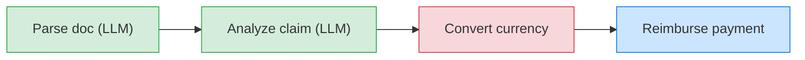
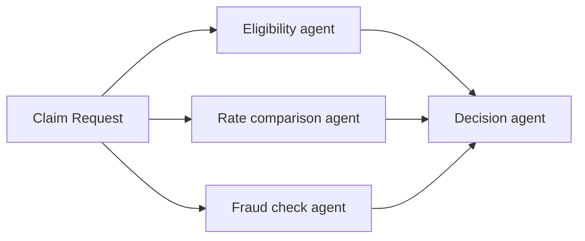
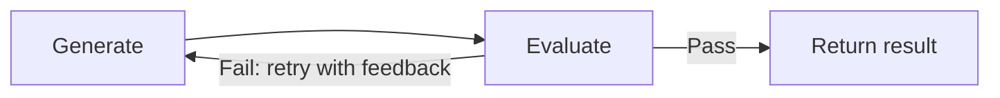
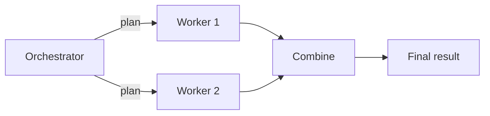

import {GlobalTabs, GlobalTab} from "/snippets/components/global-tabs.jsx";
import { GitHubLink } from '/snippets/blocks/github-link.mdx';
import SetupVercel from '/snippets/tour/ai/setup-vercel.mdx';
import SetupOpenAI from '/snippets/tour/ai/setup-openai.mdx';
import SetupGoogleADK from '/snippets/tour/ai/setup-google-adk.mdx';

Real-world workflows often mix LLM-powered steps (parsing documents, analyzing data) with traditional steps (API calls, database writes, payments). Restate lets you chain these together in a single durable pipeline where each step is checkpointed. If the process crashes after step 2 of 4, recovery skips the completed steps and resumes from step 3.

<GlobalTabs>
<GlobalTab title="Vercel AI SDK" icon={"/img/languages/typescript.svg"}/>
<GlobalTab title="OpenAI Agents SDK" icon={"/img/languages/python.svg"}/>
<GlobalTab title="Google ADK" icon={"/img/languages/python.svg"}/>
</GlobalTabs>

## Sequential pipeline

Chain agentic and traditional steps in sequence. Restate records the result of each step, so on recovery:
- Completed steps are replayed instantly from the journal
- LLM calls are not repeated (saving cost and time)
- Regular steps (API calls, payments) are not duplicated



### Example: insurance claim reimbursement

This workflow processes an insurance claim through four steps: two agentic steps that use an LLM to understand unstructured data, and two traditional steps that call external APIs.

<GlobalTabs className={"hidden-tabs"}>
<GlobalTab title="Vercel AI SDK">

```typescript workflows/sequential-pipeline.ts
export default restate.service({
  name: "ClaimReimbursement",
  handlers: {
    process: async (ctx: restate.Context, req: { document: string; claimId: string }) => {
      const model = wrapLanguageModel({
        model: openai("gpt-4o"),
        middleware: durableCalls(ctx, { maxRetryAttempts: 3 }),
      });

      // Step 1: Parse the claim document (LLM step)
      const { text: parsed } = await generateText({
        model,
        system: "Extract the claim amount, currency, category, and description from this document.",
        prompt: req.document,
      });
      const claim = JSON.parse(parsed);

      // Step 2: Analyze the claim (LLM step)
      const { text: analysis } = await generateText({
        model,
        system: "You are a claims analyst. Assess whether this claim is valid and determine the approved amount.",
        prompt: `Claim: ${parsed}`,
      });

      // Step 3: Convert currency (regular step)
      const amountUsd = await ctx.run("Convert currency", async () =>
        convertCurrency(claim.amount, claim.currency, "USD")
      );

      // Step 4: Process reimbursement (regular step)
      const confirmation = await ctx.run("Process payment", async () =>
        processPayment(req.claimId, amountUsd)
      );

      return { analysis, amountUsd, confirmation };
    },
  },
});
```

</GlobalTab>
<GlobalTab title="OpenAI Agents SDK">

```python workflows/sequential_pipeline.py
claim_service = restate.Service("ClaimReimbursement")


@claim_service.handler()
async def process(ctx: restate.Context, req: ClaimRequest) -> dict:
    # Step 1: Parse the claim document (LLM step)
    parse_agent = Agent(
        name="DocumentParser",
        instructions="Extract the claim amount, currency, category, and description.",
    )
    parsed = await DurableRunner.run(parse_agent, req.document)
    claim = json.loads(parsed.final_output)

    # Step 2: Analyze the claim (LLM step)
    analysis_agent = Agent(
        name="ClaimsAnalyst",
        instructions="Assess whether this claim is valid and determine the approved amount.",
    )
    analysis = await DurableRunner.run(analysis_agent, f"Claim: {parsed.final_output}")

    # Step 3: Convert currency (regular step)
    amount_usd = await ctx.run_typed(
        "Convert currency", convert_currency,
        amount=claim["amount"], source=claim["currency"], target="USD",
    )

    # Step 4: Process reimbursement (regular step)
    confirmation = await ctx.run_typed(
        "Process payment", process_payment,
        claim_id=req.claim_id, amount=amount_usd,
    )

    return {"analysis": analysis.final_output, "amount_usd": amount_usd, "confirmation": confirmation}
```

</GlobalTab>
<GlobalTab title="Google ADK">

```python workflows/sequential_pipeline.py
claim_service = restate.Service("ClaimReimbursement")


@claim_service.handler()
async def process(ctx: restate.Context, req: ClaimRequest) -> dict:
    # Step 1: Parse the claim document (LLM step)
    parse_agent = Agent(
        model="gemini-2.5-flash",
        name="document_parser",
        instruction="Extract the claim amount, currency, category, and description.",
    )
    app = App(name="claims", root_agent=parse_agent, plugins=[RestatePlugin()])
    runner = Runner(app=app, session_service=InMemorySessionService())

    parsed = await run_agent(runner, req.user_id, "parse", req.document)
    claim = json.loads(parsed)

    # Step 2: Analyze the claim (LLM step)
    analysis_agent = Agent(
        model="gemini-2.5-flash",
        name="claims_analyst",
        instruction="Assess whether this claim is valid and determine the approved amount.",
    )
    app = App(name="claims", root_agent=analysis_agent, plugins=[RestatePlugin()])
    runner = Runner(app=app, session_service=InMemorySessionService())

    analysis = await run_agent(runner, req.user_id, "analyze", f"Claim: {parsed}")

    # Step 3: Convert currency (regular step)
    amount_usd = await ctx.run_typed(
        "Convert currency", convert_currency,
        amount=claim["amount"], source=claim["currency"], target="USD",
    )

    # Step 4: Process reimbursement (regular step)
    confirmation = await ctx.run_typed(
        "Process payment", process_payment,
        claim_id=req.claim_id, amount=amount_usd,
    )

    return {"analysis": analysis, "amount_usd": amount_usd, "confirmation": confirmation}
```

</GlobalTab>
</GlobalTabs>

If the process crashes after the LLM analysis but before the payment, Restate recovers both LLM results from the journal and continues with the currency conversion. No LLM calls are repeated, no payments are duplicated.

## Parallel agents

Fan out work to multiple agents, then combine the results. Restate runs the agents in parallel with automatic retries and recovery. If one agent fails, only that agent is retried, the successful results are preserved.



### Example: parallel claim analysis

Three specialist agents analyze a claim concurrently. A decision agent combines their results.

<GlobalTabs className={"hidden-tabs"}>
<GlobalTab title="Vercel AI SDK">

```typescript parallelwork/parallel-agents.ts {"CODE_LOAD::https://raw.githubusercontent.com/restatedev/ai-examples/refs/heads/main/vercel-ai/tour-of-agents/src/parallelwork/parallel-agents.ts?collapse_prequel"}
export default restate.service({
  name: "ParallelAgentClaimApproval",
  handlers: {
    run: async (ctx: restate.Context, claim: InsuranceClaim) => {
      const [eligibility, rateComparison, fraudCheck] =
        await RestatePromise.all([
          ctx.serviceClient(eligibilityAgent).run(claim),
          ctx.serviceClient(rateComparisonAgent).run(claim),
          ctx.serviceClient(fraudCheckAgent).run(claim),
        ]);

      const model = wrapLanguageModel({
        model: openai("gpt-4o"),
        middleware: durableCalls(ctx, { maxRetryAttempts: 3 }),
      });

      const { text } = await generateText({
        model,
        system: "You are a claim decision engine.",
        prompt: `Decide about claim ${JSON.stringify(claim)}.
        Base your decision on the following analyses:
        Eligibility: ${eligibility}, Cost: ${rateComparison} Fraud: ${fraudCheck}`,
      });
      return text;
    },
  },
});
```
<GitHubLink url="https://github.com/restatedev/ai-examples/tree/main/vercel-ai/tour-of-agents/src/parallelwork/parallel-agents.ts" />

<Accordion title="Try out parallel agents" icon="laptop">
<SetupVercel />

Start a request for a claim that needs to be analyzed by multiple agents in parallel:
```bash
curl localhost:8080/ParallelAgentClaimApproval/run --json '{
    "date":"2024-10-01",
    "category":"orthopedic",
    "reason":"hospital bill for a broken leg",
    "amount":3000,
    "placeOfService":"General Hospital"
}'
```

In the UI, you can see that the handler called the sub-agents in parallel.
Once all sub-agents return, the main agent makes a decision.

<Frame>

</Frame>
</Accordion>

</GlobalTab>
<GlobalTab title="OpenAI Agents SDK">

```python parallel_agents.py {"CODE_LOAD::https://raw.githubusercontent.com/restatedev/ai-examples/refs/heads/main/openai-agents/tour-of-agents/app/parallel_agents.py#here"}
@agent_service.handler()
async def run(restate_context: restate.Context, claim: InsuranceClaim) -> str:
    # Start multiple agents in parallel with auto retries and recovery
    eligibility = restate_context.service_call(run_eligibility_agent, claim)
    cost = restate_context.service_call(run_rate_comparison_agent, claim)
    fraud = restate_context.service_call(run_fraud_agent, claim)

    # Wait for all responses
    await restate.gather(eligibility, cost, fraud)

    # Run decision agent on outputs
    result = await DurableRunner.run(
        Agent(
            name="ClaimApprovalAgent", instructions="You are a claim decision engine."
        ),
        input=f"Decide about claim: {claim.model_dump_json()}. "
        "Base your decision on the following analyses:"
        f"Eligibility: {await eligibility} Cost {await cost} Fraud: {await fraud}",
    )
    return result.final_output
```
<GitHubLink url="https://github.com/restatedev/ai-examples/blob/main/openai-agents/tour-of-agents/app/parallel_agents.py" />

<Accordion title="Try out parallel agents" icon="laptop">
<SetupOpenAI />

Start a request for a claim that needs to be analyzed by multiple agents in parallel:
```bash
curl localhost:8080/ParallelAgentClaimApproval/run --json '{
    "date":"2024-10-01",
    "category":"orthopedic",
    "reason":"hospital bill for a broken leg",
    "amount":3000,
    "placeOfService":"General Hospital"
}'
```

In the UI, you can see that the handler called the sub-agents in parallel.
Once all sub-agents return, the main agent makes a decision.

<Frame>

</Frame>
</Accordion>

</GlobalTab>
<GlobalTab title="Google ADK">

```python parallel_agents.py {"CODE_LOAD::https://raw.githubusercontent.com/restatedev/ai-examples/refs/heads/main/google-adk/tour-of-agents/app/parallel_agents.py#here"}
@agent_service.handler()
async def run(ctx: restate.ObjectContext, claim: InsuranceClaim) -> str | None:

    # Start multiple agents in parallel with auto retries and recovery
    eligibility = ctx.service_call(run_eligibility_agent, claim)
    cost = ctx.service_call(run_rate_comparison_agent, claim)
    fraud = ctx.service_call(run_fraud_agent, claim)

    # Wait for all responses
    await restate.gather(eligibility, cost, fraud)

    # Get the results
    eligibility_result = await eligibility
    cost_result = await cost
    fraud_result = await fraud

    # Run decision agent on outputs
    prompt = f"""Decide about claim: {claim.model_dump_json()}. Assessments:
    Eligibility: {eligibility_result} Cost: {cost_result} Fraud: {fraud_result}"""

    events = runner.run_async(
        user_id=ctx.key(),
        session_id=claim.session_id,
        new_message=Content(role="user", parts=[Part.from_text(text=prompt)]),
    )

    final_response = None
    async for event in events:
        if event.is_final_response() and event.content and event.content.parts:
            if event.content.parts[0].text:
                final_response = event.content.parts[0].text
    return final_response
```
<GitHubLink url="https://github.com/restatedev/ai-examples/blob/main/google-adk/tour-of-agents/app/parallel_agents.py" />

<Accordion title="Try out parallel agents" icon="laptop">
<SetupGoogleADK />

Start a request for a claim that needs to be analyzed by multiple agents in parallel:
```bash
curl localhost:8080/ParallelAgentClaimApproval/user123/run --json '{
    "amount": 3000,
    "category": "orthopedic",
    "date": "2024-10-01",
    "placeOfService": "General Hospital",
    "reason": "hospital bill for a broken leg",
    "sessionId": "session-123"
}'
```

In the UI, you can see that the handler called the sub-agents in parallel.
Once all sub-agents return, the main agent makes a decision.

<Frame>

</Frame>
</Accordion>

</GlobalTab>
</GlobalTabs>


## Evaluation feedback loop

Have an agent generate output, then evaluate it with a second LLM call and loop until the quality meets your criteria. Restate persists each iteration, so if the process crashes, it resumes from the last completed evaluation without re-running earlier iterations.



### Example: code generation with quality check

A generator agent writes code, then an evaluator agent checks it. If the evaluation fails, the generator retries with the feedback. Each iteration is a durable step.

<GlobalTabs className={"hidden-tabs"}>
<GlobalTab title="Vercel AI SDK">

```typescript workflows/eval-loop.ts
export default restate.service({
  name: "CodeGenerator",
  handlers: {
    generate: async (ctx: restate.Context, req: { task: string }) => {
      const model = wrapLanguageModel({
        model: openai("gpt-4o"),
        middleware: durableCalls(ctx, { maxRetryAttempts: 3 }),
      });

      let feedback = "";
      const maxIterations = 3;

      for (let i = 0; i < maxIterations; i++) {
        // Step 1: Generate code
        const { text: code } = await generateText({
          model,
          system: "You are a code generator. Write clean, correct code.",
          prompt: feedback
            ? `Task: ${req.task}\n\nPrevious attempt was rejected:\n${feedback}\n\nPlease fix the issues.`
            : `Task: ${req.task}`,
        });

        // Step 2: Evaluate the code
        const { text: evaluation } = await generateText({
          model,
          system: `You are a code reviewer. Evaluate the code for correctness,
            readability, and edge cases. Respond with PASS if acceptable,
            or FAIL: <feedback> with specific issues to fix.`,
          prompt: `Task: ${req.task}\n\nCode:\n${code}`,
        });

        if (evaluation.startsWith("PASS")) {
          return { code, iterations: i + 1 };
        }

        feedback = evaluation;
      }

      return { code: "Max iterations reached", iterations: maxIterations };
    },
  },
});
```

</GlobalTab>
<GlobalTab title="OpenAI Agents SDK">

```python workflows/eval_loop.py
generator = Agent(
    name="CodeGenerator",
    instructions="You are a code generator. Write clean, correct code.",
)

evaluator = Agent(
    name="CodeEvaluator",
    instructions="""You are a code reviewer. Evaluate the code for correctness,
    readability, and edge cases. Respond with PASS if acceptable,
    or FAIL: <feedback> with specific issues to fix.""",
)

code_service = restate.Service("CodeGenerator")


@code_service.handler()
async def generate(ctx: restate.Context, req: CodeRequest) -> dict:
    feedback = ""
    max_iterations = 3

    for i in range(max_iterations):
        # Step 1: Generate code
        prompt = (
            f"Task: {req.task}\n\nPrevious attempt was rejected:\n{feedback}\n\nPlease fix the issues."
            if feedback
            else f"Task: {req.task}"
        )
        gen_result = await DurableRunner.run(generator, prompt)
        code = gen_result.final_output

        # Step 2: Evaluate the code
        eval_result = await DurableRunner.run(
            evaluator, f"Task: {req.task}\n\nCode:\n{code}"
        )
        evaluation = eval_result.final_output

        if evaluation.startswith("PASS"):
            return {"code": code, "iterations": i + 1}

        feedback = evaluation

    return {"code": "Max iterations reached", "iterations": max_iterations}
```

</GlobalTab>
<GlobalTab title="Google ADK">

```python workflows/eval_loop.py
APP_NAME = "codegen"

generator = Agent(
    model="gemini-2.5-flash",
    name="code_generator",
    instruction="You are a code generator. Write clean, correct code.",
)

evaluator = Agent(
    model="gemini-2.5-flash",
    name="code_evaluator",
    instruction="""You are a code reviewer. Evaluate the code for correctness,
    readability, and edge cases. Respond with PASS if acceptable,
    or FAIL: <feedback> with specific issues to fix.""",
)

code_service = restate.Service("CodeGenerator")


@code_service.handler()
async def generate(ctx: restate.Context, req: CodeRequest) -> dict:
    feedback = ""
    max_iterations = 3

    for i in range(max_iterations):
        # Step 1: Generate code
        prompt = (
            f"Task: {req.task}\n\nPrevious attempt was rejected:\n{feedback}\n\nPlease fix the issues."
            if feedback
            else f"Task: {req.task}"
        )
        gen_app = App(name=APP_NAME, root_agent=generator, plugins=[RestatePlugin()])
        gen_runner = Runner(app=gen_app, session_service=InMemorySessionService())
        code = await run_agent(gen_runner, "user", f"gen-{i}", prompt)

        # Step 2: Evaluate the code
        eval_app = App(name=APP_NAME, root_agent=evaluator, plugins=[RestatePlugin()])
        eval_runner = Runner(app=eval_app, session_service=InMemorySessionService())
        evaluation = await run_agent(eval_runner, "user", f"eval-{i}", f"Task: {req.task}\n\nCode:\n{code}")

        if evaluation.startswith("PASS"):
            return {"code": code, "iterations": i + 1}

        feedback = evaluation

    return {"code": "Max iterations reached", "iterations": max_iterations}
```

</GlobalTab>
</GlobalTabs>

Each generate and evaluate call is persisted in the journal. If the process crashes after a successful generation but before evaluation, the generated code is replayed from the journal without calling the LLM again.

## Orchestrator-worker

An orchestrator agent dynamically decides what tasks to dispatch, and worker agents execute them. The orchestrator can plan, delegate, and combine results in any order. Restate ensures the orchestrator's plan and each worker's result are durably persisted.



### Example: research report generation

An orchestrator agent breaks a research topic into sub-tasks, dispatches them to worker agents, and combines the results into a report.

<GlobalTabs className={"hidden-tabs"}>
<GlobalTab title="Vercel AI SDK">

```typescript workflows/orchestrator-worker.ts
export default restate.service({
  name: "ResearchReport",
  handlers: {
    generate: async (ctx: restate.Context, req: { topic: string }) => {
      const model = wrapLanguageModel({
        model: openai("gpt-4o"),
        middleware: durableCalls(ctx, { maxRetryAttempts: 3 }),
      });

      // Step 1: Orchestrator creates a research plan
      const { text: planJson } = await generateText({
        model,
        system: `You are a research planner. Break the topic into 2-4 research
          sub-tasks. Respond with a JSON array of strings, each a specific
          research question. Example: ["question 1", "question 2"]`,
        prompt: req.topic,
      });
      const tasks: string[] = JSON.parse(planJson);

      // Step 2: Dispatch workers in parallel
      const workerResults = await RestatePromise.all(
        tasks.map((task, i) =>
          ctx.run(`research-${i}`, async () => {
            const { text } = await generateText({
              model,
              system: "You are a research assistant. Provide a concise, factual answer.",
              prompt: task,
            });
            return { question: task, answer: text };
          })
        )
      );

      // Step 3: Combine results into a report
      const { text: report } = await generateText({
        model,
        system: "You are a report writer. Combine the research findings into a cohesive report.",
        prompt: `Topic: ${req.topic}\n\nResearch findings:\n${JSON.stringify(workerResults, null, 2)}`,
      });

      return { report, taskCount: tasks.length };
    },
  },
});
```

</GlobalTab>
<GlobalTab title="OpenAI Agents SDK">

```python workflows/orchestrator_worker.py
planner = Agent(
    name="ResearchPlanner",
    instructions="""You are a research planner. Break the topic into 2-4 research
    sub-tasks. Respond with a JSON array of strings, each a specific
    research question. Example: ["question 1", "question 2"]""",
)

researcher = Agent(
    name="Researcher",
    instructions="You are a research assistant. Provide a concise, factual answer.",
)

writer = Agent(
    name="ReportWriter",
    instructions="You are a report writer. Combine the research findings into a cohesive report.",
)

report_service = restate.Service("ResearchReport")


@report_service.handler()
async def generate(ctx: restate.Context, req: ReportRequest) -> dict:
    # Step 1: Orchestrator creates a research plan
    plan_result = await DurableRunner.run(planner, req.topic)
    tasks = json.loads(plan_result.final_output)

    # Step 2: Dispatch workers in parallel
    worker_promises = []
    for task in tasks:
        promise = ctx.service_call(run_researcher, ResearchTask(question=task))
        worker_promises.append(promise)

    await restate.gather(*worker_promises)
    findings = [await p for p in worker_promises]

    # Step 3: Combine results into a report
    report_result = await DurableRunner.run(
        writer,
        f"Topic: {req.topic}\n\nResearch findings:\n{json.dumps(findings, indent=2)}",
    )

    return {"report": report_result.final_output, "task_count": len(tasks)}


researcher_service = restate.Service("Researcher")


@researcher_service.handler()
async def run_researcher(ctx: restate.Context, task: ResearchTask) -> str:
    result = await DurableRunner.run(researcher, task.question)
    return result.final_output
```

</GlobalTab>
<GlobalTab title="Google ADK">

```python workflows/orchestrator_worker.py
APP_NAME = "research"

planner = Agent(
    model="gemini-2.5-flash",
    name="research_planner",
    instruction="""You are a research planner. Break the topic into 2-4 research
    sub-tasks. Respond with a JSON array of strings, each a specific
    research question. Example: ["question 1", "question 2"]""",
)

researcher = Agent(
    model="gemini-2.5-flash",
    name="researcher",
    instruction="You are a research assistant. Provide a concise, factual answer.",
)

writer = Agent(
    model="gemini-2.5-flash",
    name="report_writer",
    instruction="You are a report writer. Combine the research findings into a cohesive report.",
)

report_service = restate.Service("ResearchReport")


@report_service.handler()
async def generate(ctx: restate.Context, req: ReportRequest) -> dict:
    # Step 1: Orchestrator creates a research plan
    plan_app = App(name=APP_NAME, root_agent=planner, plugins=[RestatePlugin()])
    plan_runner = Runner(app=plan_app, session_service=InMemorySessionService())
    plan_output = await run_agent(plan_runner, "user", "plan", req.topic)
    tasks = json.loads(plan_output)

    # Step 2: Dispatch workers in parallel
    worker_promises = []
    for task in tasks:
        promise = ctx.service_call(run_researcher, ResearchTask(question=task))
        worker_promises.append(promise)

    await restate.gather(*worker_promises)
    findings = [await p for p in worker_promises]

    # Step 3: Combine results into a report
    writer_app = App(name=APP_NAME, root_agent=writer, plugins=[RestatePlugin()])
    writer_runner = Runner(app=writer_app, session_service=InMemorySessionService())
    report = await run_agent(
        writer_runner, "user", "report",
        f"Topic: {req.topic}\n\nResearch findings:\n{json.dumps(findings, indent=2)}",
    )

    return {"report": report, "task_count": len(tasks)}


researcher_service = restate.Service("Researcher")


@researcher_service.handler()
async def run_researcher(ctx: restate.Context, task: ResearchTask) -> str:
    res_app = App(name=APP_NAME, root_agent=researcher, plugins=[RestatePlugin()])
    res_runner = Runner(app=res_app, session_service=InMemorySessionService())
    return await run_agent(res_runner, "user", task.session_id, task.question)
```

</GlobalTab>
</GlobalTabs>

The orchestrator's plan is persisted as a durable step. If the process crashes after two of four workers have completed, recovery replays those two results from the journal and only runs the remaining two workers.