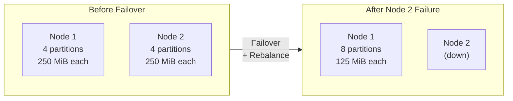
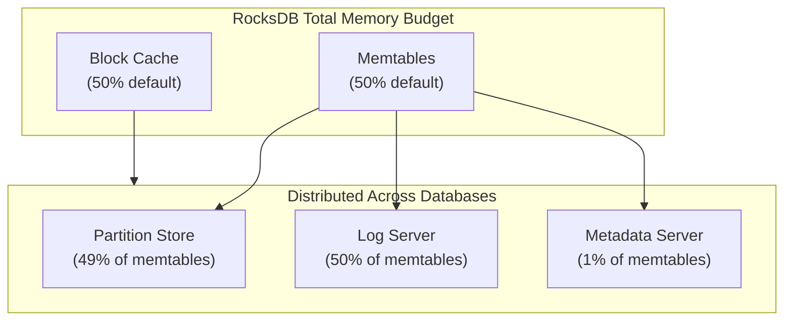

Memory is a critical resource for Restate, and the server is designed to manage it efficiently while giving you straightforward control over usage. Restate provides top-level configuration options for each major memory pool, and internally handles the complexity of distributing and rebalancing memory as your cluster scales and during failover events.

## Overview

Restate allocates memory from several distinct pools, each with its own configuration:

| Memory Pool | Default | Configuration |
|-------------|---------|---------------|
| **RocksDB** | 6 GiB | `rocksdb-total-memory-size` |
| **Query Engine** | 4 GiB | `admin.query-engine.memory-size` |
| **Bifrost Record Cache** | 250 MiB | `bifrost.record-cache-memory-size` |

The total memory footprint is approximately the sum of these pools plus overhead for the runtime, network buffers, and other internal structures. You should configure each pool based on your available resources and workload requirements.

<Info title="Default values are not minimum requirements">
The default memory values are sized for production workloads. Restate runs well with significantly less memory for development, testing, or smaller deployments.

For example, a minimal configuration suitable for development or low-traffic environments:

```toml restate.toml
# Minimal memory configuration (~1.5 GiB total)
rocksdb-total-memory-size = "1 GiB"

[admin.query-engine]
memory-size = "256 MiB"

[bifrost]
record-cache-memory-size = "128 MiB"
```

Or via environment variables:

```bash
export RESTATE_ROCKSDB_TOTAL_MEMORY_SIZE="1 GiB"
export RESTATE_ADMIN__QUERY_ENGINE__MEMORY_SIZE="256 MiB"
export RESTATE_BIFROST__RECORD_CACHE_MEMORY_SIZE="128 MiB"
```
</Info>

## RocksDB Memory

The RocksDB memory pool is typically the largest. Restate uses [RocksDB](https://rocksdb.org/) as its storage engine for durable state, journal entries, and log data.

```toml restate.toml
# Total memory limit for RocksDB caches and memtables (default: 6 GiB)
rocksdb-total-memory-size = "6 GiB"
```

**Environment variable**: `RESTATE_ROCKSDB_TOTAL_MEMORY_SIZE`

This value can be specified using human-readable byte units such as `"4 GiB"`, `"8192 MiB"`, or as a raw byte count.

Restate creates a shared block cache and write buffer manager used by all RocksDB databases on the node. The `rocksdb-total-memory-size` parameter sets the total budget that Restate internally manages and distributes across the partition store, log server, metadata server, and local loglet databases.

### Automatic Memory Rebalancing

In a cluster environment, the number of active partitions on each node can dynamically change as nodes come up, go down, and during failover events. To ensure efficient use of the memory budget regardless of how many partitions are currently active, Restate includes a memory controller that automatically rebalances memory budgets across partitions.



Every few seconds, the controller monitors memory usage across all open partition databases, redistributes the total memory budget evenly across active partitions, and triggers memtable flushes for partitions that exceed their allocated budget. The rebalancing also responds to configuration changes, so you can adjust `rocksdb-total-memory-size` at runtime and the system will adapt.

### Expected Memory Behavior

<Info title="Memory stays high after load decreases">
It is completely normal and expected to see the RocksDB memory budget remain fully consumed even after load on the cluster goes down. This is because the block cache operates as an LRU (Least Recently Used) cache.

The cache does not proactively release memory when load decreases. Instead, it retains cached data until new data needs to be cached, at which point older entries are evicted to make room. This behavior is intentional and beneficial: keeping the cache warm means that if similar queries or operations occur again, they can be served from memory rather than requiring disk I/O.

In other words, high memory usage by the block cache is a sign that the system is working efficiently, not a problem to be solved.
</Info>

## Query Engine Memory

The query engine (used for SQL introspection queries) has its own separate memory budget:

```toml restate.toml
[admin.query-engine]
# Memory budget for SQL query execution (default: 4 GiB)
memory-size = "4 GiB"
```

**Environment variable**: `RESTATE_ADMIN__QUERY_ENGINE__MEMORY_SIZE`

This memory is used for query processing, including sorting, aggregation, and join operations. Complex queries on large datasets may require more memory. If queries fail with out-of-memory errors, consider increasing this value.

## Bifrost Record Cache

The Bifrost log subsystem maintains an in-memory cache for recently accessed log records:

```toml restate.toml
[bifrost]
# In-memory record cache size (default: 250 MiB)
record-cache-memory-size = "250 MiB"
```

**Environment variable**: `RESTATE_BIFROST__RECORD_CACHE_MEMORY_SIZE`

This cache improves read performance for the replicated log by keeping recently written records in memory. Increasing this value can improve performance for workloads that frequently read from the log, such as partition replay during failover.

## Recommendations

### General Guidelines

1. **Consider allocating around 75% of available process memory to RocksDB** as a starting point. This leaves room for the query engine, Bifrost record cache, runtime, network buffers, and other components. You may need to adjust this based on your specific workload and usage patterns.

2. **On Linux, Restate automatically detects cgroup memory limits** (both v1 and v2) and will emit warnings if the configured `rocksdb-total-memory-size` is too close to the process memory limit.

3. **Monitor memory usage** using the metrics exposed by Restate to ensure your configuration is appropriate for your workload.

### Container and Kubernetes Deployments

When running Restate in containers or Kubernetes, consider setting memory pools to fit within your container's memory limit. For example, with an 8 GiB container:

```toml restate.toml
rocksdb-total-memory-size = "6 GiB"

[admin.query-engine]
memory-size = "1 GiB"
```

Or via environment variables in your container spec:

```yaml
env:
  - name: RESTATE_ROCKSDB_TOTAL_MEMORY_SIZE
    value: "6 GiB"
  - name: RESTATE_ADMIN__QUERY_ENGINE__MEMORY_SIZE
    value: "1 GiB"
```

<Warning>
If `rocksdb-total-memory-size` exceeds 90% of the process memory limit, Restate will log an error warning of potential OOM conditions. If it exceeds 100%, OOM under load is guaranteed.
</Warning>

### Using the Restate Operator

When deploying Restate on Kubernetes using the [Restate Operator](https://github.com/restatedev/restate-operator), configure memory through the `RestateCluster` resource:

```yaml
apiVersion: restate.dev/v1
kind: RestateCluster
metadata:
  name: my-cluster
spec:
  compute:
    replicas: 3
    image: restatedev/restate:latest
    resources:
      requests:
        memory: "8Gi"
      limits:
        memory: "8Gi"
  storage:
    storageRequestBytes: 10737418240  # 10 GiB
  config: |
    rocksdb-total-memory-size = "6 GiB"
    
    [admin.query-engine]
    memory-size = "1 GiB"
```

The operator passes the configuration through to the Restate server via the `spec.config` field.

## Monitoring Memory Usage

Restate exposes memory usage metrics via Prometheus at the `/metrics` endpoint on the node port (default: 5122). Key metrics to monitor include:

| Metric | Description |
|--------|-------------|
| `restate_rocksdb_memory_write_buffer_manager_capacity_bytes` | Total capacity of the write buffer manager, which manages combined memory usage across all RocksDB databases |
| `restate_rocksdb_memory_write_buffer_manager_usage_bytes` | Current usage of the write buffer manager (combined across all RocksDB databases) |
| `restate_rocksdb_memory_approx_memtable_bytes` | Approximate total memory used by memtables |
| `restate_rocksdb_memory_approx_memtable_unflushed_bytes` | Approximate memory used by unflushed memtables |
| `restate_rocksdb_block_cache_capacity_bytes` | Total block cache capacity |
| `restate_rocksdb_block_cache_usage_bytes` | Current block cache usage |

Additional per-column-family metrics are available for deeper analysis:

| Metric | Description |
|--------|-------------|
| `restate_rocksdb_cur_size_active_mem_table_bytes` | Size of the active memtable |
| `restate_rocksdb_cur_size_all_mem_tables_bytes` | Size of all memtables (active + immutable) |
| `restate_rocksdb_mem_table_flush_pending_count` | Whether a memtable flush is pending |

Example of scraping metrics:

```bash
curl http://localhost:5122/metrics | grep restate_rocksdb
```

You can also view memory statistics by sending `SIGUSR1` to the Restate process, which will dump the current configuration including memory settings to standard error.

## Troubleshooting

### OOM Errors

If the Restate process is being killed by the OOM killer:

1. **Reduce `rocksdb-total-memory-size`** to leave more headroom
2. **Reduce `admin.query-engine.memory-size`** if running complex queries
3. **Ensure container memory limits match your configuration**
4. **Review `bifrost.record-cache-memory-size`** and reduce if necessary

## Advanced Configuration

For most deployments, the top-level memory settings described above are sufficient. This section covers advanced options for fine-tuning how RocksDB memory is distributed internally.

### RocksDB Memory Architecture

RocksDB uses memory for two primary purposes:

1. **Block Cache**: An LRU cache that stores uncompressed data blocks read from disk. This speeds up read operations by avoiding disk I/O for frequently accessed data.

2. **Memtables**: In-memory write buffers where data is accumulated before being flushed to disk as sorted string tables (SST files).



### Memtable Ratio

By default, 50% of the total RocksDB memory is allocated to memtables, with the remaining 50% for the block cache. You can adjust this ratio:

```toml restate.toml
# Ratio of total memory allocated to memtables (default: 0.5)
rocksdb-total-memtables-ratio = 0.5
```

**Environment variable**: `RESTATE_ROCKSDB_TOTAL_MEMTABLES_RATIO`

A higher ratio allocates more memory to write buffers, which can improve write throughput but reduces the block cache size available for reads.

### Per-Component Memory Allocation

Within the total memtable budget, each component (partition store, log server, etc.) receives a portion based on its configured ratio. These are the defaults:

| Component | Default Ratio | Description |
|-----------|--------------|-------------|
| Partition Store | 49% | Stores service state and journal entries |
| Log Server | 50% | Stores replicated log segments |
| Metadata Server | 1% | Stores cluster metadata |

You can override the default ratios by setting a different ratio or an explicit memory budget for each component:

```toml restate.toml
[worker.storage]
# Override partition store memtable ratio (default: 0.49)
rocksdb-memory-ratio = 0.6

# Or set an explicit budget which takes precedence over the ratio
rocksdb-memory-budget = "2 GiB"

[log-server]
# Override log server memtable ratio (default: 0.5)
rocksdb-memory-ratio = 0.3

# Or set an explicit budget which takes precedence over the ratio
rocksdb-memory-budget = "1 GiB"

[metadata-server]
# Override metadata server memtable ratio (default: 0.01)
rocksdb-memory-ratio = 0.02
```

**Environment variables**:
- `RESTATE_WORKER__STORAGE__ROCKSDB_MEMORY_RATIO`
- `RESTATE_WORKER__STORAGE__ROCKSDB_MEMORY_BUDGET`
- `RESTATE_LOG_SERVER__ROCKSDB_MEMORY_RATIO`
- `RESTATE_LOG_SERVER__ROCKSDB_MEMORY_BUDGET`
- `RESTATE_METADATA_SERVER__ROCKSDB_MEMORY_RATIO`

<Info>
When both `rocksdb-memory-ratio` and `rocksdb-memory-budget` are set for a component, the explicit budget takes precedence over the ratio.
</Info>

## Configuration Reference

For the complete list of memory-related configuration options, see the [Server Configuration Reference](/references/server-config).

| Option | Default | Environment Variable | Description |
|--------|---------|---------------------|-------------|
| `rocksdb-total-memory-size` | `6 GiB` | `RESTATE_ROCKSDB_TOTAL_MEMORY_SIZE` | Total memory for RocksDB block cache and memtables |
| `rocksdb-total-memtables-ratio` | `0.5` | `RESTATE_ROCKSDB_TOTAL_MEMTABLES_RATIO` | Ratio of total memory allocated to memtables |
| `admin.query-engine.memory-size` | `4 GiB` | `RESTATE_ADMIN__QUERY_ENGINE__MEMORY_SIZE` | Memory budget for SQL query execution |
| `bifrost.record-cache-memory-size` | `250 MiB` | `RESTATE_BIFROST__RECORD_CACHE_MEMORY_SIZE` | In-memory cache for log records |
